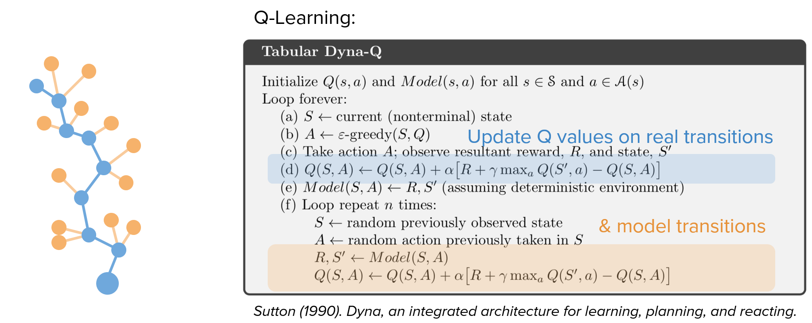
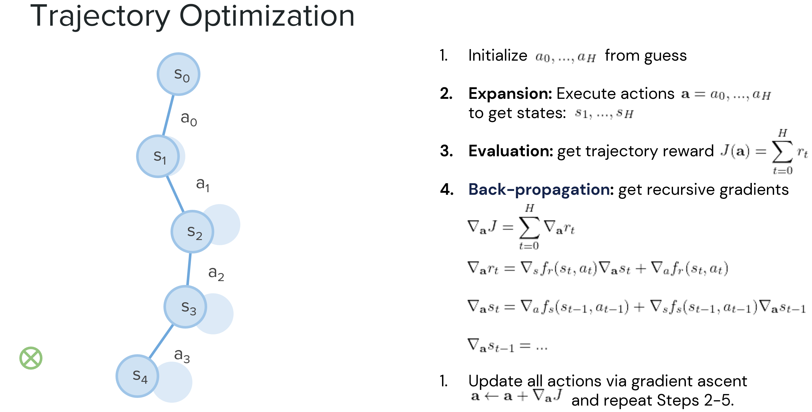
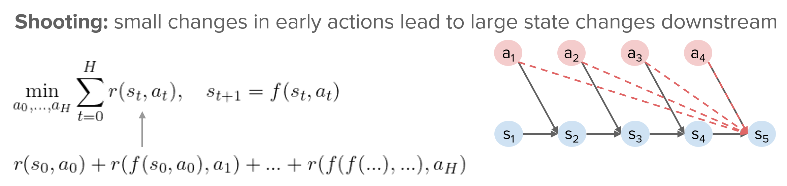
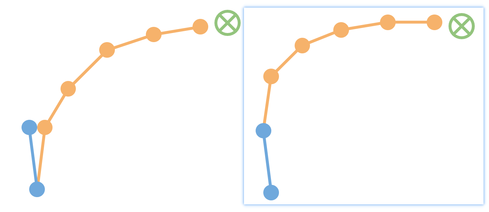
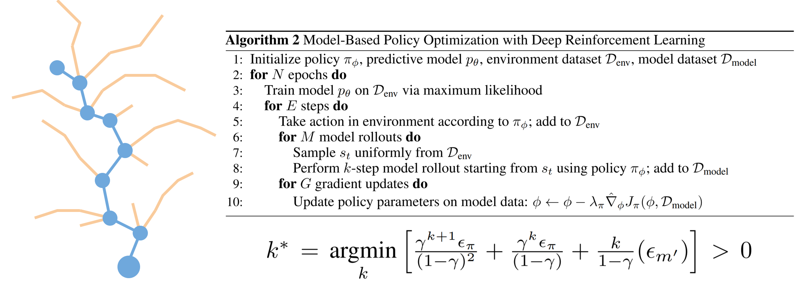
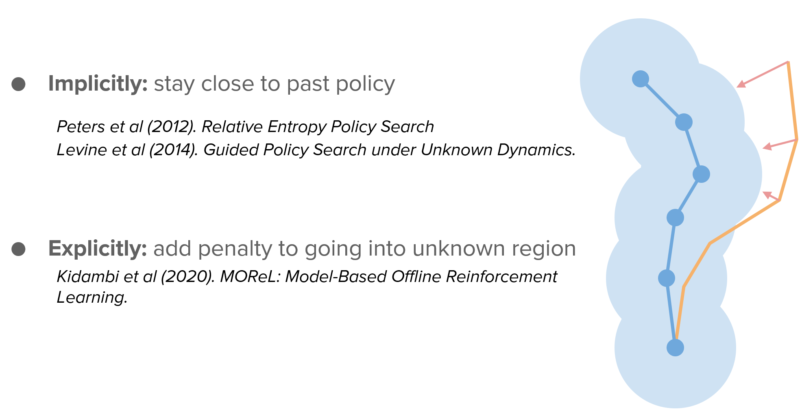

# Background and Decision-time Planning

最近看了ICML 2020上的一个Tutorial（末尾有链接分享），主题就是Model-based RL，对MBRL的归纳总结非常全面，建议一看。

刚好最近在考虑model planning的问题，因此把这篇tutorial中的planning部分单独拿出来简要介绍一下。

先把整体的methods tree放出来，便于对planning体系的理解：

## 1. Background Planning 与 Decision-time Planning

Planning可以分为**background planning**和**decision-time planning**，前者基于一个初始状态$s_0$和当前策略$\pi_t$来与你的model交互，不断生成next state和next action($s_t\rightarrow \pi(s_t)\rightarrow s_{t+1}\rightarrow\cdots$)来实现rollout，而后者则不考虑策略$\pi$，而是基于action序列$\{a_0, a_1,\ldots ,a_H\}$持续与model交互($s_t\rightarrow a_t\rightarrow s_{t+1}\rightarrow\cdots$)来实现rollout。

关于两者的区别，由于background planning的return为$J(\theta) =\mathbb{E}_{s_0}\left[\sum_{t=0}^{H} \gamma^{t} r_{t}\right], a_t=\pi_\theta(s_t)$，能够通过求期望来更全面地考虑不同初始状态$s_0$，所以其特点是**『学习在任意情况下如何更好地表现』**，通用性更好

而decision-time planning的return为$J(a_0,\ldots,a_H) = \sum_{t=0}^{H} \gamma^{t} r_{t}$，能够更快速地对当前状态做rollout，因此其特点为**『专注学习当前状态下如何更好地表现』**

两者各有优缺点，下表做了一个简单的总结：

## 2. Background Planning

Background planning主要有**模拟环境**和**辅助learning**的用法：

### 2.1 Simulating the environment

最简单直接使用model的方法，将**真实环境数据**和**模型生成数据**混合，然后执行**model-free**方法（可以看作是一种Data Augmentation）

### 2.2 Assisting the learning algorithm

策略梯度法中，在计算梯度时，transition model $f_s$ 和 reward model $f_r$ 确保我们能够使用链式法则来计算梯度$\nabla J(\theta)$

$$
J(\theta) \approx \sum_{t=0}^{H} \gamma^{t} r_{t}, \quad a_{t}=\pi_{\theta}\left(s_{t}\right), \quad s_{t+1}=f_{s}\left(s_{t}, a_{t}\right), \quad r_{t}=f_{r}\left(s_{t}, a_{t}\right)
$$

$$
\begin{aligned}
\nabla_{\theta} J &=\sum_{t=0}^{H} \gamma^{t} \nabla_{s} f_{r}\left(s_{t}, a_{t}\right) \nabla_{\theta} s_{t}+\gamma^{t} \nabla_{a} f_{r}\left(s_{t}, a_{t}\right) \nabla_{\theta} \pi_{\theta}\left(s_{t}\right) \\
\nabla_{\theta} s_{t} &=\nabla_{s} f_{s}\left(s_{t-1}, a_{t-t}\right) \nabla_{\theta} s_{t-1}+\nabla_{a} f_{s}\left(s_{t-1}, a_{s-t}\right) \nabla_{\theta} \pi_{\theta}\left(s_{t-1}\right)
\end{aligned}
$$

## 3. Decision-Time Planning

Decision-time planning分为离散型和连续型两种场景，前者的代表便是大名鼎鼎的蒙特卡洛树搜索（MCTS），后者则包含能够解决不同场景问题的具体方法。

### 3.1 Discrete

代表算法：蒙特卡洛树搜索（关于MCTS的一些简要介绍，可以看博客里的另一篇文章：[蒙特卡罗树搜索（MCTS） - 介绍](/notes/paper-reading/MCTS_introduction/)）

### 3.2 Continuous

连续型场景下，主要是通过计算梯度的方法来更新action $\boldsymbol{a}$，从而使得trajectory逐渐靠近最优解。

#### 3.2.1 解决Sensitivity问题

在shooting算法中，如下图所示，后续的状态对前面**每一时刻的状态&动作**都有依赖关系

因此，如果执行初始action $a_0$时存在一个微小扰动$\varepsilon$（显然这也是很难避免的），那么planning时，你原本预期的rollout $(a_0,\ldots)$和实际计算的rollout $(a_0+\varepsilon,\ldots)$很有可能在后期存在非常大的差异，导致你错误地估计了当前状态下执行action $a_0$的收益，从而错误地更新了策略。

在collocation算法中，通过增加$s_{t+1}$与$f(s_t,a)$的范数距离限制，确保后续状态不再受前面状态&动作影响，从而使得该问题得以改善

#### 3.2.2 解决局部最优问题

decision-time planning容易陷入局部最优，基于**交叉熵算法（CEM）**的理论保证，按照下图算法执行planning，可以更好地收敛到全局最优。

## 4 如果model不可靠？

Model-based方法虽然效率高，但由于存在**model bias**，小的误差会传播和累积，导致planning时exploit这些errors，使得后面越长的model rollout越可能不可靠。

为了尽可能规避model的不可靠性，下面的一些工作提出了不同的solution。

### 4.1 Re-Plan

*Williams et al (2017). Information Theoretic MPC for Model-Based Reinforcement Learning.*

这篇文章的方法中，在做完planning并且实际执行所挑选出来的action $a$后，真实情况与之前planning的rollout情况之间往往会存在误差，下一次plan时再遇到真实执行过动作的状态，会**接着**以前的**真实state**进行re-plan，而非又执行一步存在误差的model rollout。

### 4.2 合理控制rollout长度

*Janner et al (2019). When to Trust Your Model: Model-Based Policy Optimization.*

在MBPO方法中，通过理论分析出了model-based方法的lower bound：
$$
\eta[\pi] \geq \eta^{\mathrm{branch}}[\pi]-2 r_{\max }\left[\frac{\gamma^{k+1} \epsilon_{\pi}}{(1-\gamma)^{2}}+\frac{\gamma^{k} \epsilon_{\pi}}{(1-\gamma)}+\frac{k}{1-\gamma}\left(\epsilon_{m^{\prime}}\right)\right]
$$
在该lower bound的控制下，确定出我们可容忍的最长rollout长度：
$$
k^* = \left[\frac{\gamma^{k+1} \epsilon_{\pi}}{(1-\gamma)^{2}}+\frac{\gamma^{k} \epsilon_{\pi}}{(1-\gamma)}+\frac{k}{1-\gamma}\left(\epsilon_{m^{\prime}}\right)\right]
$$
在plan时，只要把rollout控制在$k^*$长度内，便能将误差控制在我们可接受的范围内。

### 4.3 Plan conservatively

*Rajeswaran et al (2017). EPOpt: Learning Robust Neural Network Policies Using Model Ensembles.*

这篇文章通过谨慎地进行plan，每次仅保留return结果较差的trajectory，来学习一个更robust的policy，也能一定程度地规避的model bias。

### 4.4 尽量只在model certain区域plan

还有一种方法，通过添加惩罚项（显式）或者一些熵函数（隐式）的方法，诱导planner尽量只在model certain区域做planning，也能规避掉因model uncertainty带来的error。

## 5. Reference

- Tutorial on Model-Based Methods in Reinforcement Learning. [[Link]](https://sites.google.com/view/mbrl-tutorial)