# [Paper Reading] Woodpecker: Hallucination Correction for Multimodal Large Language Models

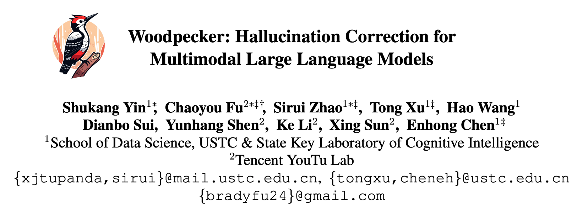

> 原文链接: [arXiv](https://arxiv.org/abs/2310.16045)

## Background

- 在多模态大模型中，常会出现幻觉（hallucination）问题，即对于一些问题并不确定，但仍会在生成信息中输出不合理的信息。

- 为了减轻语言模型的幻觉问题，现有的方法主要集中在如何finetune模型，但会严重依赖计算资源和数据，以及一些模型甚至不开放weights，存在很多限制。
- 这篇工作介绍了一种training-free的方法，主要借助外部的feedback来消除幻觉。

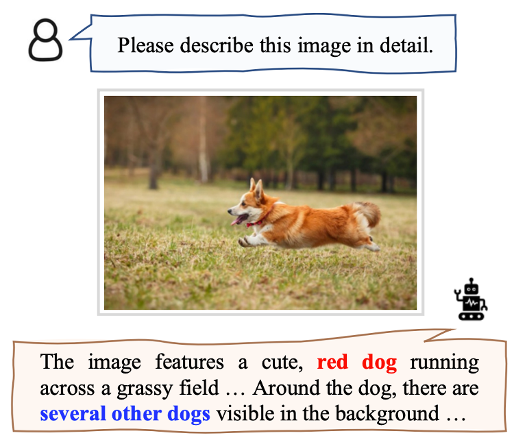

## Method

如下图所示，这篇工作的方法主要分为5个模块，我们分别具体介绍

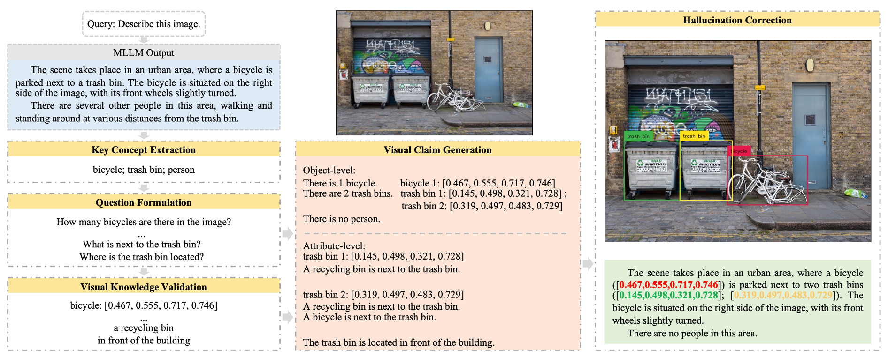

### Key Concept Extraction

- 在这一部分中，使用了`gpt-3.5-turbo`来识别大模型生成文本中提到的主要对象。
- 通过LLM的summarization能力，一些相似概念的物体会被抽象成同一个类别。

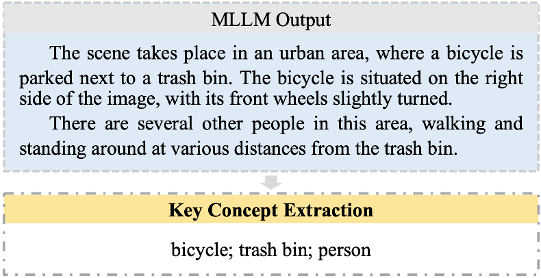

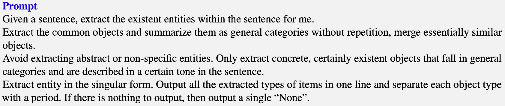

### Question Formulation

- 在提取到主要的对象后，再次使用`gpt-3.5-turbo`来预先构想出可能造成幻觉的潜在因素。
- 这些潜在因素会被进一步构造成具体的问题，传递给后面的环节，确保能关注到它们。
- 构造好的问题主要分为object-level和attribute-level，分别关注object的个体、数量方面，以及其属性层面。

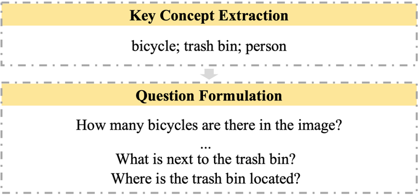

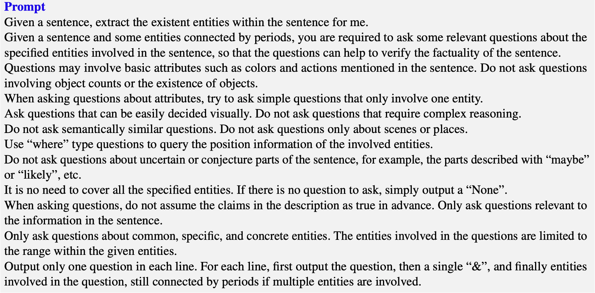

### Visual Knowledge Validation

- 针对object-level，直接引用一个object detector模型`Grounding DINO`来进行回答，它主要会提取问题中相应object在图像中的位置。
- 针对attribute-level，同样引用一个外部模型`BLIP-2-FlanT5`来进行回答。
- `BLIP-2`这样的模型因为参数量相对更小，生成的回答更短，所以不太容易出现幻觉问题，并且这些简单问题也正适合其进行回答。

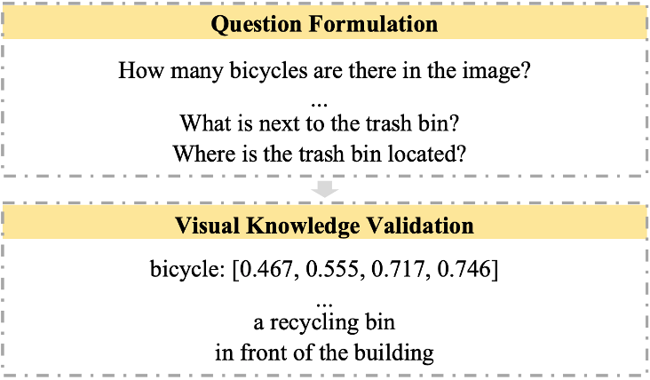

### Visual Claim Generation

- 将前面两部的问题和回答，可以整合成一个完整知识库。

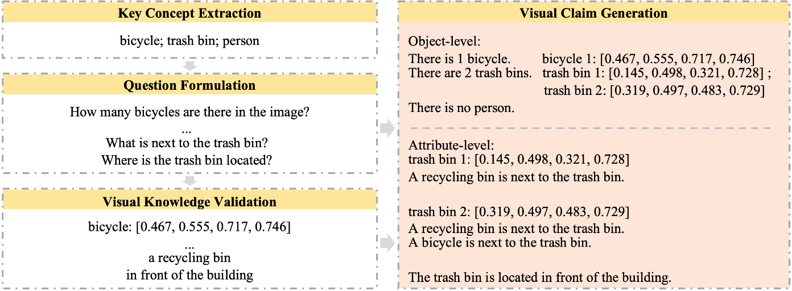

### Hallucination Correction

- 将上述的知识库，结合原始多模态模型的输出，构建prompt，使用`gpt-3.5-turbo`来给出最终优化后的输出，实现了对幻觉的消除。

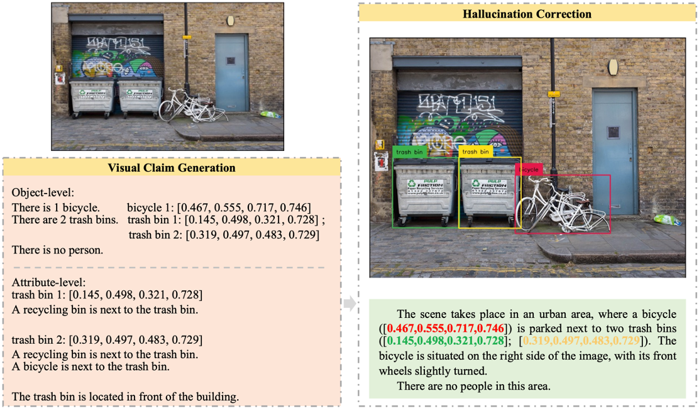

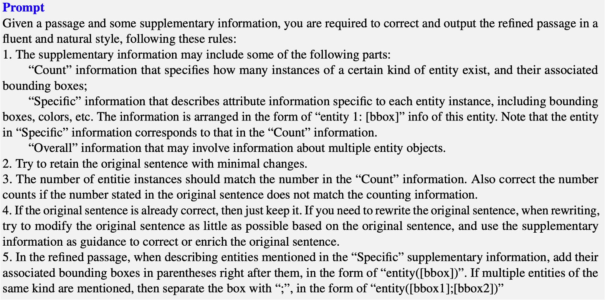

- 通过上述的流程，Woodpecker可以给出下面这样的幻觉消除效果。

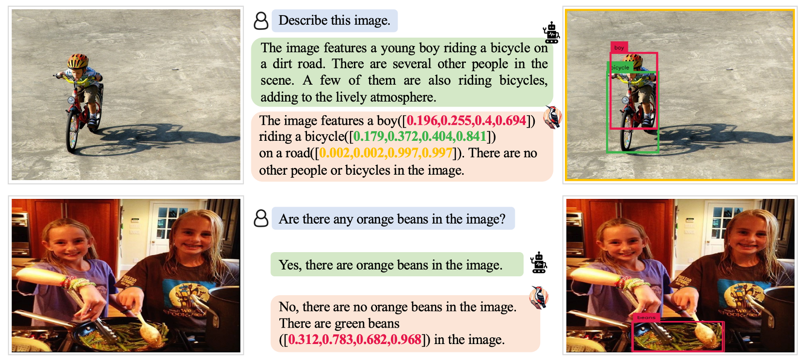

## Experiments

- 最后简单看一下实验结果，Woodpecker套用在多个多模态模型上均有可观的提升效果。

- 不过从消融实验可以看出，最大的贡献来源还是引入的object detector model，说明了引入external feedback的重要性。
- mis-correction的问题仍然有，这也是这类工作未来值得优化的一点。

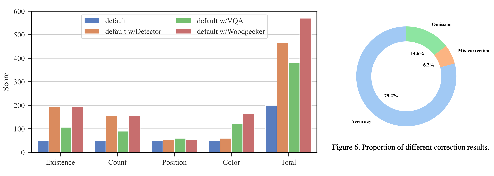
