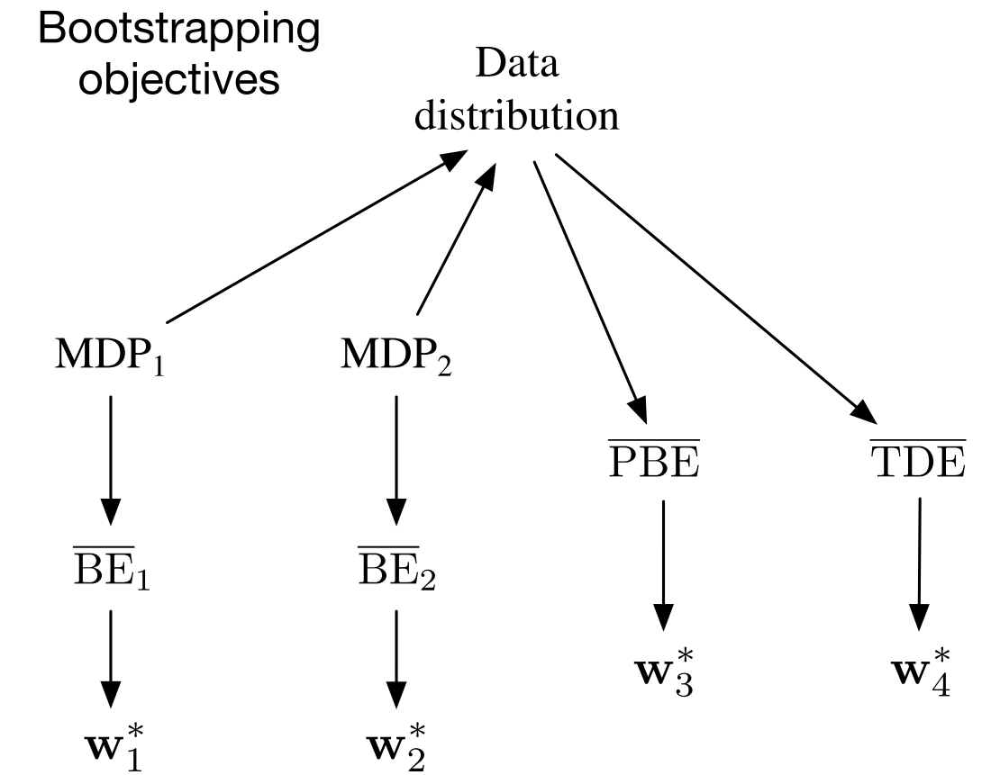

# 强化学习导论（十一）- 离线策略的近似方法

前两章（9、10 章）已经讲了on-policy 情形下对于函数近似的拓展，本章继续讲解 off-policy 下对函数近似的拓展，但是这个拓展比on-policy时更难更不同。

在第六第七章中讲到的 off-policy 方法可以拓展到函数近似的情况下，但是这些方法在半梯度法下不能像在 on-policy 下一样良好地收敛。

Off-policy 在函数逼近时有两大难点：

1. update target 发生变化。这个问题之前已通过 importance sampling 解决。

2. update distribution 发生变化，已不再是原先的 on-policy distribution。

要解决上述的第二个难点，有两种方法：

- 通过之前讲的 importance sampling 将 update distribution 转变为 on-policy distribution 。
- 提出一种不依赖任何特定分布的 true gradient 方法。

## **11.1 Semi-gradient Methods**

这一节主要目的是将 off-policy 下的查表法改造为梯度 / 半梯度法，主要针对第一个难点（变化的 update target）。大多数情况下，这个方法表现良好，少数情况存在发散的情况。

这些算法大多数采用了『**单步重要性比例**』：

$$
\rho_t\doteq\rho_{t:t}=\frac{\pi(A_t|S_t)}{b(A_t|S_t)}
$$

### **semi-gradient off-policy TD(0)**

$$
\mathbf{w}_{t+1}\doteq\mathbf{w}_t+\alpha\rho_t\delta_t\nabla\hat{v}(S_t,\mathbf{w}_t)
$$

其中

- episodic and discounted problem:

$$
\delta_t\doteq R_{t+1}+\gamma\hat{v}(S_{t+1},\mathbf{w}_t)-\hat{v}(S_t,\mathbf{w}_t)
$$

- continuing and undiscounted problem:

$$
\delta_t\doteq R_{t+1}-\bar{R}_t+\hat{v}(S_{t+1},\mathbf{w}_t)-\hat{v}(S_t,\mathbf{w}_t)
$$

### **semi-gradient Expected Sarsa**

$$
\mathbf{w}_{t+1}\doteq\mathbf{w}_t+\alpha\delta_t\nabla\hat{q}(S_t,A_t,\mathbf{w}_t)
$$

其中

- episodic and discounted problem:

$$
\delta_t\doteq R_{t+1}+\gamma\sum_a\pi(a|S_{t+1})\hat{q}(S_{t+1},a,\mathbf{w}_t)-\hat{q}(S_t,A_t,\mathbf{w}_t)
$$

- continuing and undiscounted problem:

$$
\delta_t\doteq R_{t+1}-\bar{R}_t+\sum_a\pi(a|S_{t+1})\hat{q}(S_{t+1},a,\mathbf{w}_t)-\hat{q}(S_t,A_t,\mathbf{w}_t)
$$

这里梯度更新并未使用 importance sampling ，后面会解释。

上面都是针对单步算法，而对于多步算法，无论是 state value 还是 action value ，都需要做 importance sampling 。

### **n-step semi-gradient Expected Sarsa**

$$
\begin{aligned}
\mathbf{w}_{t+n}&\doteq\mathbf{w}_{t+n-1}+\alpha\prod_{k=t+1}^{t+n}\rho_k\delta_{t:t+n}\nabla\hat{q}(S_t,A_t,\mathbf{w}_{t+n-1})\\
\delta_{t:t+n}&\doteq G_{t:t+n}-\hat{q}(S_t,A_t,\mathbf{w}_{t+n-1})
\end{aligned}
$$

其中

- episodic and discounted problem:

$$
G_{t:t+n}\doteq R_{t+1}+\cdots+\gamma^{n-1}R_{t+n}+\gamma^n\hat{q}(S_{t+n},A_{t+n},\mathbf{w}_{t+n-1})
$$

- continuing and undiscounted problem:

$$
G_{t:t+n}\doteq R_{t+1}-\bar{R}_t+\cdots+R_{t+n}-\bar{R}_{t+n-1}+\hat{q}(S_{t+n},A_{t+n},\mathbf{w}_{t+n-1})
$$

### **n-step semi-gradient tree-backup**

第七章还讲过一种不需要 importance sampling 的算法：tree-backup 算法，其半梯度法如下：

$$
\begin{aligned}
\mathbf{w}_{t+n}&\doteq\mathbf{w}_{t+n-1}+\alpha[G_{t:t+n}-\hat{q}(S_t,A_t,\mathbf{w}_{t+n-1})]\nabla\hat{q}(S_t,A_t,\mathbf{w}_{t+n-1})\\
G_{t:t+n}&\doteq\hat{q}(S_t,A_t,\mathbf{w}_{t-1})+\sum_{k=t}^{t+n-1}\delta_k\prod_{i=t+1}^k\gamma\pi(A_i|S_i)
\end{aligned}
$$

## **11.2 Examples of Off-policy Divergence**

从本节开始讨论第二类难点，也就是 update distribution 不再是 on-policy distribution 。本节主要是讲了 off-policy 下使用半梯度法导致不稳定或不收敛的反例。

例子的具体情况略过，其结论是，参数 $\mathbf{w}$ 更新的稳定性与步长参数 $\alpha$ 无关，只需大于 0 即可，而其值的大小只影响参数 $\mathbf{w}$ 发散的速度，而非是否发散。

本例的一个特殊点是，它一直在重复一个状态转移来更新 $\mathbf{w}$ （这也是实际中可能发生的情况），因为 behavior policy 可能会选择 target policy 永远不会选择的那些 action（此时 $\rho_t=0$ ，权重得不到更新）。

还有一个反例——Baird's counterexmaple ，这个例子主要是在说，bootstrapping 和 semi gradient 在非 on-policy 下结合时，会导致发散。

Q-learning 往往是收敛性最好的算法，但仍有使用 Q-learning 也发散的反例，一个解决方案是使 behavior policy 与 target policy 尽量**接近**（比如将 behavior policy 设为 target policy 的 $\varepsilon$-greedy policy ）。

## **11.3 The Deadly Triad**

上一节对存在不稳定性的情况举了例子，本节再来做一个归纳总结。

导致不稳定性有三个主要因素，称其为『**致命三因素**（The Deadly Triad）』：

1. Function Approximation
2. Bootstrapping
3. Off-policy training

结论：『**当三者同时出现，会导致系统不稳定；只出现两个时则可避免不稳定性。**』

关于三者的取舍情况，首先 function approximation **最需要保留**，他能够使我们的算法得到足够的**扩展和延伸**，变得更有**泛化能力**。

而 bootstrapping 是可以考虑放弃掉的，但代价是牺牲**计算效率和数据利用率**（bootstrapping 可以利用终止状态之前的数据来进行中途学习，所以效率高）。

最后， off-policy 能够将行为从目标函数分隔开，能够带来一定程度上的便利，但并非是必须的。不过若想要『**并行学习**』，则一定要使用 off-policy 。

## **11.4 Linear Value-function Geometry**

为了更好理解 off-policy learning 的一些问题，考虑对函数逼近做一些抽象的分析。

设状态空间中的 state-value function 为映射 $v:S\to R$ （大部分的 v 函数并没有具体意义，即不对应任何具体的 policy ） 。

记状态空间为 $\mathcal S=\{s_1,s_2,\ldots,s_{|\mathcal S|}\}$ ，value function 则为向量 $[v(s_1),v(s_2),\ldots,v(s_{|\mathcal S|})]^T$ 。

简化起见，设 $\mathcal S=\{s_1,s_2,s_3\}$ ，参数 $\mathbf{w}=(w_1,w_2)^T$ ，此时 value function $[v(s_1),v(s_2),v(s_3)]^T$ 可看作一个三维空间中的点。而参数 $\mathbf{w}$ 则能够通过一个二维子空间提供一个替代的坐标系，其线性组合而成的逼近函数 $v_{\mathbf{w}}$ 显然也在这个子空间内。

下图是一个状态空间的示例，一些具体的含义会逐渐通过后续的小节来解释。

给定一个策略 $\pi$ ，其对应的 $v_\pi$ 可能较复杂，因此难以被参数的线性组合表示出来，故 $v_\pi$ 可能在参数化的子平面外，而 approximation 要做的事情，就是在这个子平面中找到最接近离真实 $v_\pi$ 最近的逼近函数 $v_\mathbf{w}$ 。

为了衡量 value function 之间的距离，这里定义一个距离

$$
||v||_\mu^2\doteq\sum_{s\in\mathcal S}\mu(s)v(s)^2
$$

将 value function 投影到子空间最近函数的运算定义为算子 $\Pi$ ：

$$
\Pi v\doteq v_{\mathbf{w}}\quad\mathrm{where}\quad\mathbf{w}=\arg\min_\mathbf{w}||v-v_{\mathbf{w}}||_\mu^2
$$

对于一个线性估计而言，投影算子可表示为矩阵（下式之中若不可求逆，则用伪逆）

$$
\Pi \doteq \mathbf{X}(\mathbf{X}^T\mathbf{D}\mathbf{X})^{-1}\mathbf{X}^T\mathbf{D}
$$

$\mathbf{D}$ 为分布 $\mu(s)$ 的对角矩阵形式，$\mathbf{X}$ 则由特征向量组成

$$
\mathbf{D}=\left[\begin{array}{cccc}
\mu(s_1)&&&\\
&\mu(s_2)&&\\
&&\ddots&\\
&&&\mu(s_{|\mathcal S|})
\end{array}\right],\quad
\mathbf{X}=\left[\begin{array}{c}
\mathbf{x}(s_1)^T\\
\mathbf{x}(s_2)^T\\
\vdots\\
\mathbf{x}(s_{|\mathcal S|})^T
\end{array}\right]
$$

使用这两个矩阵，还可以改写出 $||v||_\mu^2=v^T\mathbf{D}v$ ，$v_\mathbf{w}=\mathbf{Xw}$ 。

回想之前求解 Bellman 方程

$$
v_\pi(s)=\sum_a\pi(a|s)\sum_{s',r}p(s',r|s,a)[r+\gamma v_\pi(s')],\forall s\in \mathcal S
$$

若将 $v_\mathbf{w}$ 用以替代 $v_\pi$ ，显然等号不再成立，于是可定义 Bellman Error (BE)：

$$
\begin{aligned}
\bar{\delta}_\mathbf{w}(s)&=\left(\sum_a\pi(a|s)\sum_{s',r}p(s',r|s,a)[r+\gamma v_\mathbf{w}(s')]\right)-v_\mathbf{w}(s)\\
&=\mathbb{E}[R_{t+1}+\gamma v_\mathbf{w}(S_{t+1})-v_\mathbf{w}(S_t)|S_t=s,A_t\sim\pi]
\end{aligned}
$$

易观察知，Bellman error 其实就是 TD error 的期望值。

可定义 **Mean Squared Bellman Error**： $\mathrm{MSBE}(\mathbf{w})=||\bar{\delta}_\mathbf{w}||_\mu^2$ 。从图 11.3 易知，线性逼近无法使 MSBE 减小至 0（需要 $v_\mathbf{w}=v_\pi$ ），后面两节会介绍如何最小化这个 MSBE 。

为简化描述，定义 Bellman 算子 $B_\pi:\mathbb{R}^{|\mathcal S|}\to \mathbb{R}^{|\mathcal S|}​$ ，将 Bellman 方程记作算子形式：

$$
(B_\pi v)(s)\doteq \sum_a\pi(a|s)\sum_{s',r}p(s',r|s,a)[r+\gamma v(s')]
$$

此时可将 Bellman error 记作 $\bar{\delta}_\mathbf{w}=B_\pi v_\mathbf{w}-v_\mathbf{w}$ 。

$B_\pi$ 能够产生子空间外新的 value function ，不断作用于 value function ，这有点类似 DP 法，它能够最终收敛到想要的 $v_\pi$ ，如图 11.3 中所示。

同样可以将 Bellman error 投影到参数子空间，得到 $\Pi \bar{\delta}_{v_\mathbf{w}}$ ，此时可定义 **Mean Square Projected Bellman Error**：

$$
\mathrm{MSPBE}(\mathbf{w})=||\Pi\bar{\delta}_\mathbf{w}||_\mu^2
$$

对于线性逼近而言，这时显然就可以在子空间内找到使 MSPBE 为 0 的最优点了，这个点恰好就是前面讲过的 TD 不动点。

## **11.5 Gradient Descent in the Bellman Error**

前一节介绍了多种目标函数（MSVE、MSBE、MSPBE 等），这一节回到 off-policy learning 问题。

若想使这些目标函数最小化，一般考虑 SGD 来处理，但前面讲过，只有 MC 才是 true SGD ，此时无论是 on-policy 还是 off-policy 其收敛性都很鲁棒，只不过收敛速度较半梯度法稍慢，而半梯度法则在 off-policy 训练中容易发散，且不太适合用于非线性逼近，true SGD 就不存在这种问题。

11.5 & 11.6 节以 Bellman error 为目标函数来做优化，不过需要先说明的是，这种算法其实并不好，它的失败之处其实很有意思，能够为我们找到好方法提供思路。

首先，在以前的 TD 法中定义过一个 TD error：$\delta_t=R_{t+1}+\gamma\hat{v}(S_{t+1},\mathbf{w}_t)-\hat{v}(S_t,\mathbf{w}_t)$ ，但并未以它为优化目标来研究过，于是定义『**均方 TD error**』：

$$
\begin{aligned}
\mathrm{MSTDE}(\mathbf{w})&=\sum_{s\in\mathcal S}\mu(s)\mathbb{E}[\delta_t^2|S_t=s,A_t\sim\pi]\\
&=\sum_{s\in\mathcal S}\mu(s)\mathbb{E}[\rho_t\delta_t^2|S_t=s,A_t\sim b]\\
&=\mathbb{E}_b[\rho_t\delta_t^2]
\end{aligned}
$$

此时的 SGD 更新式为

$$
\begin{aligned}
\mathbf{w}_{t+1}&=\mathbf{w}_t-\frac{1}{2}\alpha\nabla(\rho_t\delta_t^2)\\
&=\mathbf{w}_t-\alpha\rho_t\delta_t\nabla\delta_t\\
&=\mathbf{w}_t+\alpha\rho_t\delta_t(\nabla\hat{v}(S_t,\mathbf{w}_t)-\gamma\nabla\hat{v}(S_{t+1},\mathbf{w}_t))
\end{aligned}
$$

这是一个 true SGD 法，称其为『**naive residual-gradient 算法**』。此方法虽然收敛性很鲁棒，但其实它收敛到的值并不是理想值，下面的一个例子具体地展现了这一点（真实最优解的 MSTDE 反而更大）。

另一个更好的想法是优化 Bellman error，也就是 TD error 的期望，称该算法为『**residual gradient 算法**』其更新式为

从中看出，此更新式中有两个含有 $S_{t+1}$ 的期望式，为保证无偏性，这两个 $S_{t+1}$ 应该是独立的，所以需要**在每一步都采两个样本**，如果环境是**确定性**的，那么采取同一 action 后 $S_t\to S_{t+1}$ 的过程便是确定的，两处的 $S_{t+1}$ 也必然是相同值，故做一次采样即可；但若是**非确定性**的环境，则必须采两次样，这在**真实环境**中无法做到（一旦和环境交互就已确定，不可回退），只能在**模拟环境**中通过回退再次模拟来实现。

这个算法是 true SGD，故也有较强的收敛性，但有三个缺点：

- 比半梯度法慢
- 可能收敛到错误值（如例 11.3 所示）
- 可能不收敛（下一节讲）

## **11.6 The Bellman Error is Not Learnable**

本节的『**可学习**（learnable）』与传统机器学习中的 learnable 定义（能够在多项式复杂度下有效地学习）不同，在强化学习中，若一些量**在给定内部结构、知识等信息后可以计算，但通过观测得到的序列却无法计算或估计出来**，则称这些量是**不可学习**的。

上面的例子中，两个不同的问题却有可能产生出相同的观测序列。若设 $\gamma = 0$ ，三个 state 的 true value 应为 1、0、2 ，若设 $w=1$ ，则左图的 MSVE 为 0 ，右图的 MSVE 为 1 。同样的观测序列，对应的理论 MSVE 值却不同，说明如果不给出问题背景，就无法学出正确对应的 MSVE ，因此 MSVE 就是 not learnable 的。

MSVE 仍然有一定使用价值，事实上，有着相同分布的 MDP 问题的**最优参数其实是相同的**，利用这个特殊性质，仍然可以采用 MSVE 作为目标函数来进行优化。

为更好理解，下面引入一个可学习的 『**Mean Square Return Error**』来探讨，他在 on-policy 下写作

$$
\begin{aligned}
\mathrm{MSRE}(\mathbf{w})&=\mathbb{E}[(G_t-\hat{v}(S_t,\mathbf{w}))^2]\\
&=\mathrm{MSVE}(\mathbf{w})+\mathbb{E}[(G_t-v_\pi(S_t))^2]
\end{aligned}
$$

可以看出，MSRE 比 MSVE 多出一项与参数 $\mathbf{w}$ 无关的项，因此两种目标函数对应的最优参数 $\mathbf{w}^*$ 是相同的，而 MSRE 又是可学习的，故事实上仍可用 MSVE 来做优化。他们的关系如下图所示。

再来看 MSBE ，他和 MSVE 一样，可由 MDP 问题结构信息计算求得，而无法通过观测 / 经验数据来进行学习。但与 MSVE 不同的是，观测序列的分布相同时，求出的最优解不再相同。下面的例子描述了这一情况。

此外，另两种 bootstrapping 目标函数 MSPBE、MSTDE 可由 data 学习（learnable），他们的关系如下图所示。

MSBE 由于不可学习，故只能用于 model-based learning，residual-gradient 是唯一能最小化 MSBE 的算法，需要对同一 state 做两次采样，对环境信息依赖程度较大，故此方法局限性较高。

## **11.7 Gradient-TD Methods**

现考虑最小化 MSPBE 的 SGD 方法，下面介绍推导复杂度为 $O(d)$ 的算法。

首先，将 MSPBE 写作矩阵形式

$$
\begin{aligned}
\mathrm{MSPBE}(\mathbf{w})&=||\Pi\bar{\delta}_\mathbf{w}||_\mu^2\\
&=(\Pi\bar{\delta}_\mathbf{w})^T\mathbf{D}\Pi\bar{\delta}_\mathbf{w}\\
&=\bar{\delta}_\mathbf{w}^T\Pi^T\mathbf{D}\Pi\bar{\delta}_\mathbf{w}\\
\end{aligned}
$$

由于前面已定义 $\Pi = \mathbf{X}(\mathbf{X}^T\mathbf{D}\mathbf{X})^{-1}\mathbf{X}^T\mathbf{D}$ ，故有（注意 $\mathbf{D}$ 是对称矩阵）

$$
\begin{aligned}
\Pi^T\mathbf{D}\Pi&=[\mathbf{X}(\mathbf{X}^T\mathbf{D}\mathbf{X})^{-1}\mathbf{X}^T\mathbf{D}]^T\mathbf{D}[\mathbf{X}(\mathbf{X}^T\mathbf{D}\mathbf{X})^{-1}\mathbf{X}^T\mathbf{D}]\\
&=\mathbf{DX}(\mathbf{X}^T\mathbf{DX})^{-1}\mathbf{X}^T\mathbf{D}\mathbf{X}(\mathbf{X}^T\mathbf{D}\mathbf{X})^{-1}\mathbf{X}^T\mathbf{D}\\
&=\mathbf{DX}(\mathbf{X}^T\mathbf{D}\mathbf{X})^{-1}\mathbf{X}^T\mathbf{D}
\end{aligned}
$$

回到前式即得

$$
\mathrm{MSPBE}=(\mathbf{X}^T\mathbf{D}\bar{\delta}_\mathbf{w})^{T}(\mathbf{X}^T\mathbf{D}\mathbf{X})^{-1}(\mathbf{X}^T\mathbf{D}\bar{\delta}_\mathbf{w})
$$

则其梯度为

$$
\nabla\mathrm{MSPBE}(\mathbf{w})=[2\nabla(\mathbf{X}^T\mathbf{D}\bar{\delta}_\mathbf{w})^{T}](\mathbf{X}^T\mathbf{D}\mathbf{X})^{-1}(\mathbf{X}^T\mathbf{D}\bar{\delta}_\mathbf{w})
$$

$\mu$ 是 behavior policy 下的状态分布，故上式中的各部分都可表示为该分布下的期望：

$$
\begin{aligned}
\mathbf{X}^T\mathbf{D}\bar{\delta}_\mathbf{w}&=\sum_s\mu(s)\mathbf{x}(s)\bar{\delta}_\mathbf{w}(s)=\mathbb{E}[\rho_t\delta_t\mathbf{x}_t]\\
\nabla(\mathbf{X}^T\mathbf{D}\bar{\delta}_\mathbf{w})^T&=\mathbb{E}[\rho_t\delta_t\mathbf{x}_t]^T=\mathbb{E}[\rho_t\nabla\delta_t^T\mathbf{x}_t^T]\\
&=\mathbb{E}[\rho_t\nabla(R_{t+1}+\gamma\mathbf{w}^T\mathbf{x}_{t+1}-\mathbf{w}^T\mathbf{x}_{t})^T\mathbf{x}_t^T]\\
&=\mathbb{E}[\rho_t(\gamma\mathbf{x}_{t+1}-\mathbf{x}_t)\mathbf{x}_t^T]\\
\mathbf{X}^T\mathbf{DX}&=\sum_s\mu(s)\mathbf{x}_s\mathbf{x}_s^T=\mathbb{E}[\mathbf{x}_t\mathbf{x}_t^T]
\end{aligned}
$$

代回前式，即得

$$
\nabla\mathrm{MSPBE}(\mathbf{w})=2\mathbb{E}[\rho_t(\gamma\mathbf{x}_{t+1}-\mathbf{x}_t)\mathbf{x}_t^T]\mathbb{E}[\mathbf{x}_t\mathbf{x}_t^T]^{-1}\mathbb{E}[\rho_t\delta_t\mathbf{x}_t]
$$

此时梯度为三个期望的乘积，且一、三项不独立，都依赖下一时刻的 $\mathbf{x}_{t+1}$（第三项中是含在 $\delta_t$ 内），所以不能对每个值采样然后直接相乘求期望，而应考虑分别分别对期望求估计后再组合得到梯度的无偏估计，但计算资源消耗较大，一个改进措施是，只估计某两项，然后对剩下一项做采样。

先估计并存储后两项，得到向量

$$
\mathbf{v}\approx\mathbb{E}[\mathbf{x}_t\mathbf{x}_t^T]^{-1}\mathbb{E}[\rho_t\delta_t\mathbf{x}_t]
$$

观察发现上式和一般『**最小平方问题**』解的形式（$\mathbf{w}=(\mathbf{\Phi}^T\mathbf{\Phi})^{-1}\mathbf{\Phi}^T\mathbf{t}$）相似，此问题可看作是对 $\rho_t\delta_t$ 求最小平方估计，为了优化上面约等式误差，以 $(\mathbf{v}^T\mathbf{x}_t-\rho_t\delta_t)^2$ 为目标函数，可得 SGD 更新式

$$
\mathbf{v}_{t+1}=\mathbf{v}_t+\beta(\rho_t\delta_t-\mathbf{v}_t^T\mathbf{x}_t)\mathbf{x}_t
$$

使用这个方法可以在每一步得到更新的 $\mathbf{v}$ ，在存储了 $\mathbf{v}$ 的情况下，参数 $\mathbf{w}$ 的更新式为

$$
\begin{aligned}
\mathbf{w}_{t+1}&=\mathbf{w}_t-\frac{1}{2}\alpha\nabla\mathrm{MSPBE}(\mathbf{w}_t)\\
&=\mathbf{w}_t-\frac{1}{2}\alpha 2\mathbb{E}[\rho_t(\gamma\mathbf{x}_{t+1}-\mathbf{x}_t)\mathbf{x}_t^T]\mathbb{E}[\mathbf{x}_t\mathbf{x}_t^T]^{-1}\mathbb{E}[\rho_t\delta_t\mathbf{x}_t]\\
&=\mathbf{w}_t+\alpha\mathbb{E}[\rho_t(\mathbf{x}_t-\gamma\mathbf{x}_{t+1})\mathbf{x}_t^T]\mathbb{E}[\mathbf{x}_t\mathbf{x}_t^T]^{-1}\mathbb{E}[\rho_t\delta_t\mathbf{x}_t]\\
&\approx\mathbf{w}_t+\alpha\mathbb{E}[\rho_t(\mathbf{x}_t-\gamma\mathbf{x}_{t+1})\mathbf{x}_t^T]\mathbf{v}_t\\
&\approx\mathbf{w}_t+\alpha\rho_t(\mathbf{x}_t-\gamma\mathbf{x}_{t+1})\mathbf{x}_t^T\mathbf{v}_t\qquad(\mathrm{sampling})
\end{aligned}
$$

称此算法为『GTD2』，若先计算 $(\mathbf{x}_t^T\mathbf{v}_t)$ ，则算法复杂度为 $O(d)$ 。一个略微的改进是计算 $\mathbf{v}_t$ 前先做一点分析调整

$$
\begin{aligned}
\mathbf{w}_{t+1}&=\mathbf{w}_t+\alpha\mathbb{E}[\rho_t(\mathbf{x}_t-\gamma\mathbf{x}_{t+1})\mathbf{x}_t^T]\mathbb{E}[\mathbf{x}_t\mathbf{x}_t^T]^{-1}\mathbb{E}[\rho_t\delta_t\mathbf{x}_t]\\
&=\mathbf{w}_t+\alpha(\mathbb{E}[\rho_t\mathbf{x}_t\mathbf{x}_t^T]-\gamma\mathbb{E}[\rho_t\mathbf{x}_{t+1}\mathbf{x}_t^T])\mathbb{E}[\mathbf{x}_t\mathbf{x}_t^T]^{-1}\mathbb{E}[\rho_t\delta_t\mathbf{x}_t]\\
&=\mathbf{w}_t+\alpha(\mathbb{E}[\rho_t\delta_t\mathbf{x}_t]-\gamma\mathbb{E}[\rho_t\mathbf{x}_{t+1}\mathbf{x}_t^T]\mathbb{E}[\mathbf{x}_t\mathbf{x}_t^T]^{-1}\mathbb{E}[\rho_t\delta_t\mathbf{x}_t])\\
&\approx\mathbf{w}_t+\alpha(\mathbb{E}[\rho_t\delta_t\mathbf{x}_t]-\gamma\mathbb{E}[\rho_t\mathbf{x}_{t+1}\mathbf{x}_t^T]\mathbf{v}_t)\\
&\approx\mathbf{w}_t+\alpha\rho_t(\delta_t\mathbf{x}_t-\gamma\mathbf{x}_{t+1}\mathbf{x}_t^T\mathbf{v}_t) \qquad (\mathrm{sampling})
\end{aligned}
$$

称此算法为『TD(0) with gradient correction (TDC)』或者『GTD(0)』若先计算 $(\mathbf{x}_t^T\mathbf{v}_t)$ ，则算法复杂度为 $O(d)$ 。

TDC 算法在 Baird 反例上的实际表现如下图所示

GTD2 及 TDC 都包含了两个学习过程，主过程学习 $\mathbf{w}$ ，次过程学习 $\mathbf{v}$  。次过程在每一步中需要先于主过程，这种依赖关系称之为『**层叠**（cascade）』，关于学习率，通常需要满足极限

$$
\beta\to 0,\quad\frac{\alpha}{\beta}\to0
$$

Gradient TD 方法是最简单易懂的稳定 off-policy 方法，并且有很多的衍生方法。

## **11.8 Emphatic-TD Methods**

这一节简单介绍了 Emphatic-TD 算法：

$$
\begin{aligned}
\delta_t&=R_{t+1}+\gamma\hat{v}(S_{t+1},\mathbf{w}_t)-\hat{v}(S_t,\mathbf{w}_t)\\
\mathbf{w}_{t+1}&=\mathbf{w}_t+\alpha M_t\rho_t\delta_t\nabla\hat{v}(S_t,\mathbf{w}_t)\\
M_t&=\gamma\rho_{t-1}M_{t-1}+I_t
\end{aligned}
$$

其中 $I_t$ 表示 interest，为随机值，$M_t$ 表示 emphasis 。

Emphatic-TD 算法在 Baird 反例上的实际表现如下图所示

该算法方差较大，导致其并不实用，所以如何减少算法的方差很值得研究。

## **11.9 Reducing Variance**

off-policy 算法直观上显然要比 on-policy 算法有着更大的方差，他从行为策略中获得的数据可能和目标策略关系不大，极端情况下甚至可能完全学不到东西，比如一个人不能通过做饭的经验知识来学习如何开车。

只有当 behavior policy 与 target policy 相关性较大，即当两个策略经过的 states、actions 很接近，才能在 off-policy training 中取得较好的进展。

关于这些**相关但又不一致**的行为策略，主要的问题是如何尽量利用上他们。目前而言这一块已有很多相关的工作，本节末尾列举了很多方法，不作具体介绍。