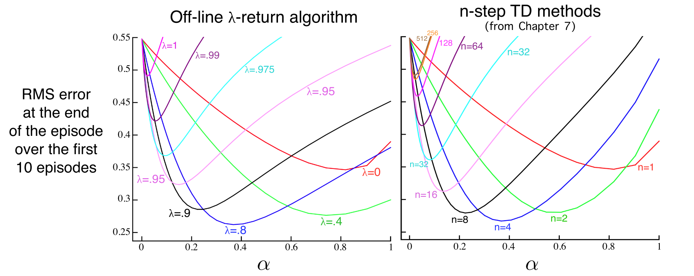

# 强化学习导论（十二）- 资格迹

Eligibility Traces 是强化学习的基本原理之一。几乎所有 TD 方法都可以和 eligibility traces 结合起来生成更高效通用的方法。

在 TD($\lambda$) 方法中，$\lambda\in[0,1]$，两个极端的例子是 MC ($\lambda=1$) 和 1-step TD ($\lambda=0$)。

与n-step方法相比：

- Eligibility Traces 方法只需存储一个trace vector，而不是 n 个最新的 feature vectors
- 学习过程是连续且均匀的，不会有延迟
- 不需要在 episode 结束时才进行所有运算
- 学习可以立刻影响行为，不需要 n step 后才延迟生效

前面讲过的很多方法根据后面的一些 rewards 来更新，这种形式称为 forward views ，通常 forward views 并不实用，因为 update 依赖于当前未知的量，这一章会介绍一种新方法，采用 eligibility trace 往前看最近经过的 states ，从而得到当前 TD error ，称之为 backward views 。

## **12.1 The $\lambda$-return**

n-step return 的定义如下：

$$
G _ { t : t + n } \doteq R _ { t + 1 } + \gamma R _ { t + 2 } + \cdots + \gamma ^ { n - 1 } R _ { t + n } + \gamma ^ { n } \hat { v } \left( S _ { t + n } , \mathbf { w } _ { t + n - 1 } \right)
$$

现在考虑多个 n-step return 的加权平均，只需权重和为 1，仍能用作 update target，如 $\frac { 1 } { 2 } G _ { t : t + 2 } + \frac { 1 } { 2 } G _ { t : t + 4 }$ ，这种更新方式称为 compound update，其 backup 图如下

TD($\lambda$) 也属于这种 averaging n-step update ，他包括了所有的 n-step updates，权重系数分别为 $\lambda^{n-1}, \lambda\in[0,1]$，$\lambda$-return 定义如下（其中 $1-\lambda$ 确保能归一化）：

$$
G _ { t } ^ { \lambda } \doteq ( 1 - \lambda ) \sum _ { n = 1 } ^ { \infty } \lambda ^ { n - 1 } G _ { t : t + n }
$$

其 backup 图如下：

将上式提取一部分出来，可写为

$$
G _ { t } ^ { \lambda } = ( 1 - \lambda ) \sum _ { n = 1 } ^ { T - t - 1 } \lambda ^ { n - 1 } G _ { t : t + n } + \lambda ^ { T - t - 1 } G _ { t }
$$

观察可知，当 $\lambda=1$ ，此方法为 MC；当 $\lambda=0$ ，此方法为 1-step TD。

更一般地，将这个 $G_t^\lambda$ 作为 update target ，此算法称为『**offline $\lambda$-return algorithm**』，采用半梯度法更新：

$$
\mathbf { w } _ { t + 1 } \doteq \mathbf { w } _ { t } + \alpha \left[ G _ { t } ^ { \lambda } - \hat { v } \left( S _ { t } , \mathbf { w } _ { t } \right) \right] \nabla \hat { v } \left( S _ { t } , \mathbf { w } _ { t } \right)
$$

下图通过一个实例比较了算法效果：

目前我们讨论的方法都是『**forward views**』算法，在每个 state 处都能得到一些未来的信息，如下面示意图所示。

## **12.2 TD($\lambda$)**

本节介绍的 TD($\lambda$) 对上一节的 offline $\lambda$-return 有三点提升：

- 单步更新权重向量，无需等待 episode 结束
- 计算在时间上均匀分布
- 不仅可用于 episode 问题，还适用于连续问题

本节引入 eligibility trace $\mathbf{z}_t\in \mathbb{R}^d$ ，他与权向量 $\mathbf{w}_t$ 维度相同，权向量有长期的记忆性，其存在时间与系统等长，而 eligibility trace 则体现短期记忆，存在于 episode 内的一个子片段中。

eligibility trace 定义如下：

$$
\begin{array} { l } { \mathbf { z } _ { - 1 } \doteq \mathbf { 0 } } \\ { \mathbf { z } _ { t } \doteq \gamma \lambda \mathbf { z } _ { t - 1 } + \nabla \hat { v } \left( S _ { t } , \mathbf { w } _ { t } \right) , \quad 0 \leq t \leq T } \end{array}
$$

eligibility trace 一直在追踪那些对『**recent state valuation**』有贡献的权重分量，这个 recent 体现在系数 $\gamma\lambda$ 上。

在 1-step TD 中，TD error 为

$$
\delta _ { t } \doteq R _ { t + 1 } + \gamma \hat { v } \left( S _ { t + 1 } , \mathbf { w } _ { t } \right) - \hat { v } \left( S _ { t } , \mathbf { w } _ { t } \right)
$$

更新式为

$$
\mathbf { w } _ { t + 1 } \doteq \mathbf { w } _ { t } + \alpha \delta _ { t }\color{blue}{\nabla\hat{v}(S_t,\mathbf{w}_t)}
$$

将梯度增加一些信息

$$
\mathbf { w } _ { t + 1 } \doteq \mathbf { w } _ { t } + \alpha \delta _ { t }[\color{blue}{\nabla\hat{v}(S_t,\mathbf{w}_t)+\gamma\lambda\mathbf{z}_{t-1}}]
$$

即可得到 TD($\lambda$) 的更新式

$$
\mathbf { w } _ { t + 1 } \stackrel { \cdot } { = } \mathbf { w } _ { t } + \alpha \delta _ { t } \mathbf { z } _ { t }
$$

算法伪代码如下

TD($\lambda$) 是 backward 的，即，每个时刻得到新的 TD error 后，又依据它对之前 states 的 eligibility trace 作一些调整，如下面示意图所示。

算法的实际测试效果如下图所示

当 $\lambda=0$ 时，trace 恰好就是 value function 的梯度，此时正好对应 1-step TD ；当 $\lambda=1$ 时，可以看出每一个 state 都刚好衰减 $\gamma$ 倍，跑完这个 episode ，恰好就是 MC 。可以看出，使用了 eligibility trace 后仍能统一地表示各种算法。

若满足条件

$$
\sum _ { n = 1 } ^ { \infty } \alpha _ { n } = \infty \quad \text { and } \quad \sum _ { n = 1 } ^ { \infty } \alpha _ { n } ^ { 2 }< \infty
$$

线性 TD($\lambda$) 可以在 on-policy 下确保收敛，此时有上界

$$
\overline { \mathrm { VE } } \left( \mathbf { w } _ { \infty } \right) \leq \frac { 1 - \gamma \lambda } { 1 - \gamma } \min _ { \mathbf { w } } \overline { \mathrm { VE } } ( \mathbf { w } )
$$

## **12.3 n-step Truncated $\lambda$-return Methods**

前面讲过的 offline $\lambda$-return 是一个重要的概念，但并不实用，因为他需要跑完一整个 episode 才能结束，而在连续型任务中，n 可以无限大，$\lambda$-return 无法计算，因此需要考虑将序列截断，用估计值来替代抛弃掉的较远的 rewards 。

定义 truncated $\lambda$-return 如下：

$$
G _ { t :h } ^ { \lambda } \doteq ( 1 - \lambda ) \sum _ { n = 1 } ^ { h - t - 1 } \lambda ^ { n - 1 } G _ { t : t + n } + \lambda ^ { h - t - 1 } G _ { t : h }
$$

而之前定义的完整的 $\lambda$-return 为：

$$
G _ { t } ^ { \lambda } = ( 1 - \lambda ) \sum _ { n = 1 } ^ { T - t - 1 } \lambda ^ { n - 1 } G _ { t : t + n } + \lambda ^ { T - t - 1 } G _ { t }
$$

对比可知，truncated $\lambda$-return 提前结束了模拟（后面未模拟部分用估计值代替），在此算法中，update 只被延迟了 n 步。称该算法为 truncated TD($\lambda$) ，或 TTD($\lambda$) 。

下面是算法的 backup 示意图：

算法的更新式为

$$
\mathbf { w } _ { t + n } \doteq \mathbf { w } _ { t + n - 1 } + \alpha \left[ G _ { t : t + n } ^ { \lambda } - \hat { v } \left( S _ { t } , \mathbf { w } _ { t + n - 1 } \right) \right] \nabla \hat { v } \left( S _ { t } , \mathbf { w } _ { t + n - 1 } \right)
$$

其中

$$
\begin{aligned}
&G_ { t : t + k } ^ { \lambda } = \hat { v } \left( S _ { t } , \mathbf { w } _ { t - 1 } \right) + \sum _ { i = t } ^ { t + k - 1 } ( \gamma \lambda ) ^ { i - t } \delta _ { i } ^ { \prime }\\
&\delta _ { t } ^ { \prime } \doteq R _ { t + 1 } + \gamma \hat { v } \left( S _ { t + 1 } , \mathbf { w } _ { t } \right) - \hat { v } \left( S _ { t } , \mathbf { w } _ { t - 1 } \right)
\end{aligned}
$$

## **12.4 Redoing Updates: The Online $\lambda$-return Algorithm**

实用 truncated TD 涉及到对 n 的平衡，n 越大越接近 offline $\lambda$-return ，越小则更新速度越快。此平衡是可以达到的，方法是每次获得新数据后，重新从头开始执行所有更新：

$$
\begin{array} { c l }{h = 1 : }&{ \mathbf { w } _ { 1 } ^ { 1 } \doteq \mathbf { w } _ { 0 } ^ { 1 } + \alpha \left[ G _ { 0 : 1 } ^ { \lambda } - \hat { v } \left( S _ { 0 } , \mathbf { w } _ { 0 } ^ { 1 } \right) \right] \nabla \hat { v } \left( S _ { 0 } , \mathbf { w } _ { 0 } ^ { 1 } \right)}\\\\{ h = 2 : } & { \mathbf { w } _ { 1 } ^ { 2 } \doteq \mathbf { w } _ { 0 } ^ { 2 } + \alpha \left[ G _ { 0 : 2 } ^ { \lambda } - \hat { v } \left( S _ { 0 } , \mathbf { w } _ { 0 } ^ { 2 } \right) \right] \nabla \hat { v } \left( S _ { 0 } , \mathbf { w } _ { 0 } ^ { 2 } \right) } \\ { } & { \mathbf { w } _ { 2 } ^ { 2 } \doteq \mathbf { w } _ { 1 } ^ { 2 } + \alpha \left[ G _ { 1 : 2 } ^ { \lambda } - \hat { v } \left( S _ { 1 } , \mathbf { w } _ { 1 } ^ { 2 } \right) \right] \nabla \hat { v } \left( S _ { 1 } , \mathbf { w } _ { 1 } ^ { 2 } \right) }\\\\{ h = 3 :} &{ \mathbf { w } _ { 1 } ^ { 3 } \doteq \mathbf { w } _ { 0 } ^ { 3 } + \alpha \left[ G _ { 0 : 3 } ^ { \lambda } - \hat { v } \left( S _ { 0 } , \mathbf { w } _ { 0 } ^ { 3 } \right) \right] \nabla \hat { v } \left( S _ { 0 } , \mathbf { w } _ { 0 } ^ { 3 } \right) } \\ {}&{ \mathbf { w } _ { 2 } ^ { 3 } \doteq \mathbf { w } _ { 1 } ^ { 3 } + \alpha \left[ G _ { 1 : 3 } ^ { \lambda } - \hat { v } \left( S _ { 1 } , \mathbf { w } _ { 1 } ^ { 3 } \right) \right] \nabla \hat { v } \left( S _ { 1 } , \mathbf { w } _ { 1 } ^ { 3 } \right) } \\{}& { \mathbf { w } _ { 3 } ^ { 3 } \doteq \mathbf { w } _ { 2 } ^ { 3 } + \alpha \left[ G _ { 2 : 3 } ^ { \lambda } - \hat { v } \left( S _ { 2 } , \mathbf { w } _ { 2 } ^ { 3 } \right) \right] \nabla \hat { v } \left( S _ { 2 } , \mathbf { w } _ { 2 } ^ { 3 } \right) } \end{array}
$$

其中 $\mathbf{w}_0^h$ 都继承自上一个 episode（因此所有的 $\mathbf{w}_0^h$ 也都为同一值），$\mathbf{w}_h^h$ 则为每一步的更新结果。

更一般的表示为：

$$
\mathbf { w } _ { t + 1 } ^ { h } \doteq \mathbf { w } _ { t } ^ { h } + \alpha \left[ G _ { t : h } ^ { \lambda } - \hat { v } \left( S _ { t } , \mathbf { w } _ { t } ^ { h } \right) \right] \nabla \hat { v } \left( S _ { t } , \mathbf { w } _ { t } ^ { h } \right)
$$

此算法称为『**online $\lambda$-return algorithm**』，是完全在线算法，每个时间点 t 均使用已有数据产生一个新权重向量 $\mathbf{w}_t$ 。

他在每个时间点 h 都能充分利用上 h 时间之前的所有信息，可以看出现在这种算法对数据的利用率更高，更新效果更好，缺点则为每次均需从头计算，复杂度高。

下面是实际的性能比较：

## **12.5 True Online TD($\lambda$)**

online $\lambda$-return 效果很好，但计算复杂度太高，需要考虑利用 eligibility trace 将算法变换为 backward view 算法，这便是本节要讲的『**true online TD($\lambda$)**』。

之前的 online $\lambda$-return 方法产生的权重序列如下：

$$
\begin{array}{cccccc}
    \mathbf{w}_0^0 &  &  &  &  &  \\
    \mathbf{w}_0^1 & \mathbf{w}_1^1 &  &  &  &  \\
    \mathbf{w}_0^2 & \mathbf{w}_1^2 & \mathbf{w}_2^2 &  &  &  \\
    \mathbf{w}_0^3 & \mathbf{w}_1^3 & \mathbf{w}_2^3 & \mathbf{w}_3^3 &  &  \\
    \vdots & \vdots & \vdots & \vdots & \ddots &  \\
    \mathbf{w}_0^T & \mathbf{w}_1^T & \mathbf{w}_2^T & \mathbf{w}_3^T & \cdots & \mathbf{w}_T^T
\end{array}
$$

事实上，我们需要的只是每行最后一个权重 $\mathbf{w}_t^t$ ，得到 $\mathbf{w}_t=\mathbf{w}_t^t$ 。

对于 linear case，true online TD($\lambda$) 定义如下：

$$
\begin{array}{l}
\mathbf { w } _ { t + 1 } \doteq \mathbf { w } _ { t } + \alpha \delta _ { t } \mathbf { z } _ { t } + \alpha \left( \mathbf { w } _ { t } ^ { \top } \mathbf { x } _ { t } - \mathbf { w } _ { t - 1 } ^ { \top } \mathbf { x } _ { t } \right) \left( \mathbf { z } _ { t } - \mathbf { x } _ { t } \right)\\
\mathbf { z } _ { t } \doteq \gamma \lambda \mathbf { z } _ { t - 1 } + \left( 1 - \alpha \gamma \lambda \mathbf { z } _ { t - 1 } ^ { \top } \mathbf { x } _ { t } \right) \mathbf { x } _ { t }
\end{array}
$$

此算法可以产生和 online $\lambda$-return 算法一样的结果，空间要求和 TD($\lambda$) 相同，计算量稍微增加了 50%，但仍为 $O(d)$ 复杂度。

这一节 true online TD($\lambda$) 使用的 eligibility trace 称为『**dutch trace**』，之前的 TD($\lambda$) 中则称为『**accumulating trace**』。

## **12.6 Dutch Traces in Monte Carlo Learning**

尽管 eligibility trace 于 TD 方法结合紧密，但他们本质上并无联系，事实上，eligibility trace 起源于 MC learning ，下面用一个例子简单介绍一下。

线性情况下，梯度 MC 法的更新式如下：

$$
\mathbf { w } _ { t + 1 } \doteq \mathbf { w } _ { t } + \alpha \left[ G - \mathbf { w } _ { t } ^ { \top } \mathbf { x } _ { t } \right] \mathbf { x } _ { t }
$$

为了简化问题，这里的 return $G$ 只是 episode 结束后得到的单个 reward（因此没有下标），并且没有做 discounting 。想要做的优化就是，在 episode 每一步都进行一些计算，但仍只在 episode 结束后才进行更新，所以复杂度仍为 $O(d)$。算法如下：

$$
\begin{aligned} \mathbf { w } _ { T } & = \mathbf { w } _ { T - 1 } + \alpha \left( G - \mathbf { w } _ { T - 1 } ^ { \top } \mathbf { x } _ { T - 1 } \right) \mathbf { x } _ { T - 1 } \\ & = \mathbf { w } _ { T - 1 } + \alpha \mathbf { x } _ { T - 1 } \left( - \mathbf { x } _ { T - 1 } ^ { \top } \mathbf { w } _ { T - 1 } \right) + \alpha G \mathbf { x } _ { T - 1 } \\ & = \left( \mathbf { I } - \alpha \mathbf { x } _ { T - 1 } \mathbf { x } _ { T - 1 } ^ { \top } \right) \mathbf { w } _ { T - 1 } + \alpha G \mathbf { x } _ { T - 1 } \\ & = \mathbf { F } _ { T - 1 } \mathbf { w } _ { T - 1 } + \alpha G \mathbf { x } _ { T - 1 } \end{aligned}
$$

这里引入 $\mathbf { F } _ { t } \doteq \mathbf { I } - \alpha \mathbf { x } _ { t } \mathbf { x } _ { t } ^ { \top }$ 称为 遗忘矩阵（or 衰退矩阵），接上式，下面进行递归

$$
\begin{array} { l } { = \mathbf { F } _ { T - 1 } \left( \mathbf { F } _ { T - 2 } \mathbf { w } _ { T - 2 } + \alpha G \mathbf { x } _ { T - 2 } \right) + \alpha G \mathbf { x } _ { T - 1 } } \\ { = \mathbf { F } _ { T - 1 } \mathbf { F } _ { T - 2 } \mathbf { w } _ { T - 2 } + \alpha G \left( \mathbf { F } _ { T - 1 } \mathbf { x } _ { T - 2 } + \mathbf { x } _ { T - 1 } \right) } \\ { = \mathbf { F } _ { T - 1 } \mathbf { F } _ { T - 2 } \left( \mathbf { F } _ { T - 3 } \mathbf { w } _ { T - 3 } + \alpha G \mathbf { x } _ { T - 3 } \right) + \alpha G \left( \mathbf { F } _ { T - 1 } \mathbf { x } _ { T - 2 } + \mathbf { x } _ { T - 1 } \right) } \\ { = \mathbf { F } _ { T - 1 } \mathbf { F } _ { T - 2 } \mathbf { F } _ { T - 3 } \mathbf { W } _ { T - 3 } + \alpha G \left( \mathbf { F } _ { T - 1 } \mathbf { F } _ { T - 2 } \mathbf { x } _ { T - 3 } + \mathbf { F } _ { T - 1 } \mathbf { x } _ { T - 2 } + \mathbf { x } _ { T - 1 } \right) }
\\\vdots\\
= \underbrace { \mathbf { F } _ { T - 1 } \mathbf { F } _ { T - 2 } \cdots \mathbf { F } _ { 0 } \mathbf { w } _ { 0 } } _ { \mathbf { a } _ { T - 1 } } + \alpha G \underbrace {\sum _ { k = 0 } ^ { T - 1 } \mathbf { F } _ { T - 1 } \mathbf { F } _ { T - 2 } \cdots \mathbf { F } _ { k + 1 } \mathbf { x } _ { k }}_{\mathbf{z}_{T-1}}\\
= \mathbf { a } _ { T - 1 } + \alpha G \mathbf { z } _ { T - 1 }
\end{array}
$$

其中 $\mathbf{a}_{T-1}, \mathbf{z}_{T-1}$ 是 T-1 时刻的两个辅助记忆向量，即使不知道 G ，也能在每步先做一些这样的计算，用以存储一些信息。

事实上，$\mathbf{z}_t$ 是一个 dutch-style eligibility trace，初始值为 $\mathbf{z}_0=\mathbf{x}_0$ ，他的更新式为：

$$
\begin{aligned} \mathbf { z } _ { t } & \doteq \sum _ { k = 0 } ^ { t } \mathbf { F } _ { t } \mathbf { F } _ { t - 1 } \cdots \mathbf { F } _ { k + 1 } \mathbf { x } _ { k } , \quad 1 \leq t < T \\ & = \sum _ { k = 0 } ^ { t - 1 } \mathbf { F } _ { t } \mathbf { F } _ { t - 1 } \cdots \mathbf { F } _ { k + 1 } \mathbf { x } _ { k } + \mathbf { x } _ { t } \\ & = \mathbf { F } _ { t } \sum _ { k = 0 } ^ { t - 1 } \mathbf { F } _ { t - 1 } \mathbf { F } _ { t - 2 } \cdots \mathbf { F } _ { k + 1 } \mathbf { x } _ { k } + \mathbf { x } _ { t } \\
  &= \mathbf { F } _ { t } \mathbf { z } _ { t - 1 } + \mathbf { x } _ { t }  \\ & = \left( \mathbf { I } - \alpha \mathbf { x } _ { t } \mathbf { x } _ { t } ^ { \top } \right) \mathbf { z } _ { t - 1 } + \mathbf { x } _ { t }  \\ & = \mathbf { z } _ { t - 1 } - \alpha \mathbf { x } _ { t } \mathbf { x } _ { t } ^ { \top } \mathbf { z } _ { t - 1 } + \mathbf { x } _ { t }  \\ & = \mathbf { z } _ { t - 1 } - \alpha \left( \mathbf { z } _ { t - 1 } ^ { \top } \mathbf { x } _ { t } \right) \mathbf { x } _ { t } + \mathbf { x } _ { t }  \\ & = \mathbf { z } _ { t - 1 } + \left( 1 - \alpha \mathbf { z } _ { t - 1 } ^ { \top } \mathbf { x } _ { t } \right) \mathbf { x } _ { t }
\end{aligned}
$$

辅助向量 $\mathbf{a}_t$ 初始值为 $\mathbf{a}_0=\mathbf{w}_0$ ，更新式为

$$
\mathbf { a } _ { t } \doteq \mathbf { F } _ { t } \mathbf { F } _ { t - 1 } \cdots \mathbf { F } _ { 0 } \mathbf { w } _ { 0 } = \mathbf { F } _ { t } \mathbf { a } _ { t - 1 } = \mathbf { a } _ { t - 1 } - \alpha \mathbf { x } _ { t } \mathbf { x } _ { t } ^ { \top } \mathbf { a } _ { t - 1 }
$$

在 t < T 时，每步更新辅助向量 $\mathbf{a}_t,\mathbf{z}_t$ ，当 T 时刻获得 G 后再最终计算出 $\mathbf{w}_T$。得到的结果和 MC 相同，但计算更简单。

本例说明了 eligibility trace 并不局限于 TD 方法，只要想做长期预测，都可以采用 eligibility trace 。

## **12.7 Sarsa($\lambda$)**

这一节把 eligibility trace 从 state-value 扩展到 action-value，只需简单地将 $\hat{v}(s,\mathbf{w})$ 变为 $\hat{q}(s,a,\mathbf{w})$ 。

action-value 形式的 n-step return 为：

$$
G _ { t : t + n } \doteq R _ { t + 1 } + \cdots + \gamma ^ { n - 1 } R _ { t + n } + \gamma ^ { n } \hat { q } \left( S _ { t + n } , A _ { t + n } , \mathbf { w } _ { t + n - 1 } \right)
$$

利用这个 return ，可以根据前面公式构造 action-value 形式的 truncated $\lambda$-return $G_t^\lambda$ ，进而得到 action-value 形式的 offline $\lambda$-return 算法：

$$
\mathbf { w } _ { t + 1 } \doteq \mathbf { w } _ { t } + \alpha \left[ G _ { t } ^ { \lambda } - \hat { q } \left( S _ { t } , A _ { t } , \mathbf { w } _ { t } \right) \right] \nabla \hat { q } \left( S _ { t } , A _ { t } , \mathbf { w } _ { t } \right)
$$

算法示意图如下：

Sarsa($\lambda$) 和 TD($\lambda$) 相似，更新式为

$$
\begin{array}{l}
\mathbf { w } _ { t + 1 } \stackrel { \cdot } { = } \mathbf { w } _ { t } + \alpha \delta _ { t } \mathbf { z } _ { t }\\
\delta _ { t } \doteq R _ { t + 1 } + \gamma \hat { q } \left( S _ { t + 1 } , A _ { t + 1 } , \mathbf { w } _ { t } \right) - \hat { q } \left( S _ { t } , A _ { t } , \mathbf { w } _ { t } \right)\\
{ \mathbf { z } _ { - 1 } \doteq \mathbf { 0 } } \\ { \mathbf { z } _ { t } \doteq \gamma \lambda \mathbf { z } _ { t - 1 } + \nabla \hat { q } \left( S _ { t } , A _ { t } , \mathbf { w } _ { t } \right) }
\end{array}
$$

算法伪码如下：

该算法与传统的 n-step sarsa 效果对比如下：

上面是 offline $\lambda$-return 算法，下面介绍 action-value 的 online $\lambda$-return 算法。

本节算法之间的比较：

## **12.8 Variable $\lambda$ and $\gamma​$**

为了更泛化地表示每一步中 bootstrapping 和 discounting 的程度，需要更通用的 $\lambda,\gamma$ ，现定义函数 $\lambda : \mathcal{S} \times \mathcal { A } \rightarrow [ 0,1 ]$ 和 $\gamma : \mathcal{S} \rightarrow [ 0,1 ]$ ，从而得到 $\lambda _ { t } \doteq \lambda \left( S _ { t } , A _ { t } \right),\gamma _ { t } \doteq \gamma \left( S _ { t } \right)$ 。

函数 $\gamma$ 称为『**termination function**』，现在重新定义 return ：

$$
\begin{aligned} G _ { t } & \doteq R _ { t + 1 } + \gamma _ { t + 1 } G _ { t + 1 } \\ & = R _ { t + 1 } + \gamma _ { t + 1 } R _ { t + 2 } + \gamma _ { t + 1 } \gamma _ { t + 2 } R _ { t + 3 } + \gamma _ { t + 1 } \gamma _ { t + 2 } \gamma _ { t + 3 } R _ { t + 4 } + \cdots \\ & = \sum _ { k = t } ^ { \infty } \left( \prod _ { i = t + 1 } ^ { k } \gamma _ { i } \right) R _ { k + 1 } \end{aligned}
$$

为保证结果有限，需要 $\prod _ { k = t } ^ { \infty } \gamma _ { k } = 0$ 。

这种形式的好处是，episodic 任务无需再指定开始状态和结束状态，只需使 $\gamma(s)=0$ 即可，因此便能统一 episodic 和 discounted-continuing 。

上面说了对 discounting 的泛化，下面再介绍对 bootstrapping 的泛化。

若考虑对 state-value 做 bootstrap ，则泛化参数记为 $\lambda_s$ ，同理若对 action-value 做 bootstrap ，则泛化参数记为 $\lambda_a$（$\lambda$ 控制了 bootstrap 的程度，当为 1 时完全不做 bootstrap ，当为 0 时则完全是在 bootstrap ）。于是可以得到新的**递归**形式的 state-based $\lambda$-return ：

$$
G _ { t } ^ { \lambda s } \doteq R _ { t + 1 } + \gamma _ { t + 1 } \left( \left( 1 - \lambda _ { t + 1 } \right) \hat { v } \left( S _ { t + 1 } , \mathbf { w } _ { t } \right) + \lambda _ { t + 1 } G _ { t + 1 } ^ { \lambda s } \right)
$$

或是 action-based $\lambda$-return ：

$$
G _ { t } ^ { \lambda a } \doteq R _ { t + 1 } + \gamma _ { t + 1 } \left( \left( 1 - \lambda _ { t + 1 } \right) \hat { q } \left( S _ { t + 1 } , A _ { t + 1 } , \mathbf { w } _ { t } \right) + \lambda _ { t + 1 } G _ { t + 1 } ^ { \lambda a } \right)
$$

或者 Expected Sarsa 形式：

$$
\begin{aligned}
&G _ { t } ^ { \lambda a } \doteq R _ { t + 1 } + \gamma _ { t + 1 } \left( \left( 1 - \lambda _ { t + 1 } \right) \overline { V } _ { t } \left( S _ { t + 1 } \right) + \lambda _ { t + 1 } G _ { t + 1 } ^ { \lambda a } \right)\\
&\overline { V } _ { t } ( s ) \doteq \sum _ { a } \pi ( a | s ) \hat { q } \left( s , a , \mathbf { w } _ { t } \right)
\end{aligned}
$$

## **12.9 Off-policy Traces with Control Variates**

本节主要将 importance sampling 整合进算法。这里采用第 7 章的 per-decision 方法，定义如下的 $\lambda$-return ：

$$
G _ { t } ^ { \lambda s } \doteq \rho _ { t } \left( R _ { t + 1 } + \gamma _ { t + 1 } \left( \left( 1 - \lambda _ { t + 1 } \right) \hat { v } \left( S _ { t + 1 } , \mathbf { w } _ { t } \right) + \lambda _ { t + 1 } G _ { t + 1 } ^ { \lambda s } \right) \right) + \left( 1 - \rho _ { t } \right) \hat { v } \left( S _ { t } , \mathbf { w } _ { t } \right)
$$

他的 truncated 形式可由 state-based TD error 逼近得到：

$$
\begin{aligned}
&\delta _ { t } ^ { s } \doteq R _ { t + 1 } + \gamma _ { t + 1 } \hat { v } \left( S _ { t + 1 } , \mathbf { w } _ { t } \right) - \hat { v } \left( S _ { t } , \mathbf { w } _ { t } \right)\\
&G _ { t } ^ { \lambda s } \approx \hat { v } \left( S _ { t } , \mathbf { w } _ { t } \right) + \rho _ { t } \sum _ { k = t } ^ { \infty } \delta _ { k } ^ { s } \prod _ { i = t + 1 } ^ { k } \gamma _ { i } \lambda _ { i } \rho _ { i }
\end{aligned}
$$

通过上面形式的 $\lambda$-return ，可以方便地进行 forward-view 更新

$$
\begin{aligned} \mathbf { w } _ { t + 1 } & = \mathbf { w } _ { t } + \alpha \left( G _ { t } ^ { \lambda s } - \hat { v } \left( S _ { t } , \mathbf { w } _ { t } \right) \right) \nabla \hat { v } \left( S _ { t } , \mathbf { w } _ { t } \right) \\ & \approx \mathbf { w } _ { t } + \alpha \rho _ { t } \left( \sum _ { k = t } ^ { \infty } \delta _ { k } ^ { s } \prod _ { i = t + 1 } ^ { k } \gamma _ { i } \lambda _ { i } \rho _ { i } \right) \nabla \hat { v } \left( S _ { t } , \mathbf { w } _ { t } \right) \end{aligned}
$$

下面探究 forward view 和 backward view 的近似关系。对整个 forward view 过程进行求和，得到：

$$
\begin{aligned} \sum _ { t = 1 } ^ { \infty } \left( \mathbf { w } _ { t + 1 } - \mathbf { w } _ { t } \right) & \approx \sum _ { t = 1 } ^ { \infty } \sum _ { k = t } ^ { \infty } \alpha \rho _ { t } \delta _ { k } ^ { s } \nabla \hat { v } \left( S _ { t } , \mathbf { w } _ { t } \right) \prod _ { i = t + 1 } ^ { k } \gamma _ { i } \lambda _ { i } \rho _ { i } \\ & = \sum _ { k = 1 } ^ { \infty } \sum _ { t = 1 } ^ { k } \alpha \rho _ { t } \nabla \hat { v } \left( S _ { t } , \mathbf { w } _ { t } \right) \delta _ { k } ^ { s } \prod _ { i = t + 1 } ^ { k } \gamma _ { i } \lambda _ { i } \rho _ { i } \\ & = \sum _ { k = 1 } ^ { \infty } \alpha \delta _ { k } ^ { s } \sum _ { t = 1 } ^ { k } \rho _ { t } \nabla \hat { v } \left( S _ { t } , \mathbf { w } _ { t } \right) \prod _ { i = t + 1 } ^ { k } \gamma _ { i } \lambda _ { i } \rho _ { i } \end{aligned}
$$

其中第二个等号用到了一个求和规则：

$$
\sum _ { t = x } ^ { y } \sum _ { k = t } ^ { y } = \sum _ { k = x } ^ { y } \sum _ { t = x } ^ { k }
$$

若上式的第二个求和项可写作 eligibility trace 并用于更新，则更新式变为 backward view TD update 。即，若表达式为 k 时刻的 trace，那他可由 k-1 时刻的值更新而得：

$$
\begin{aligned} \mathbf { z } _ { k } & = \sum _ { t = 1 } ^ { k } \rho _ { t } \nabla \hat { v } \left( S _ { t } , \mathbf { w } _ { t } \right) \prod _ { i = t + 1 } ^ { k } \gamma _ { i } \lambda _ { i } \rho _ { i } \\ & = \sum _ { t = 1 } ^ { k - 1 } \rho _ { t } \nabla \hat { v } \left( S _ { t } , \mathbf { w } _ { t } \right) \prod _ { i = t + 1 } ^ { k } \gamma _ { i } \lambda _ { i } \rho _ { i } + \rho _ { k } \nabla \hat { v } \left( S _ { k } , \mathbf { w } _ { k } \right) \\ & = \gamma _ { k } \lambda _ { k } \rho _ { k } \underbrace{\sum _ { t = 1 } ^ { k - 1 } \rho _ { t } \nabla \hat { v } \left( S _ { t } , \mathbf { w } _ { t } \right) \prod _ { i = t + 1 } ^ { k - 1 } \gamma _ { i } \lambda _ { i } \rho _ { i }}_{\mathbf{z}_{k-1}} +\rho_k\nabla\hat{v}(S_k,\mathbf{w}_k)\\ & = \rho _ { k } \left( \gamma _ { k } \lambda _ { k } \mathbf { z } _ { k - 1 } + \nabla \hat { v } \left( S _ { k } , \mathbf { w } _ { k } \right) \right) \end{aligned}
$$

整理即得

$$
\mathbf { z } _ { t } \doteq \rho _ { t } \left( \gamma _ { t } \lambda _ { t } \mathbf { z } _ { t - 1 } + \nabla \hat { v } \left( S _ { t } , \mathbf { w } _ { t } \right) \right)
$$

这个 eligibility trace 结合 半梯度 TD($\lambda$) 更新即为一般的 TD($\lambda$) 算法（$\rho_t=1$ 时对应 on-policy）。在 off-policy 情况下，算法性能还不错，但是作为一个半梯度算法，稳定性欠佳（后面几节会考虑扩展此算法来保证稳定性）。

对于 action-value 情况的算法，其实和 state-value 情况类似，现构造一个 action-based $\lambda$-return ：

$$
\begin{aligned} G _ { t } ^ { \lambda a } & \doteq R _ { t + 1 } + \gamma _ { t + 1 } \left( \left( 1 - \lambda _ { t + 1 } \right) \overline { V } _ { t } \left( S _ { t + 1 } \right) + \lambda _ { t + 1 } \left[ \rho _ { t + 1 } G _ { t + 1 } ^ { \lambda a } + \overline { V } _ { t } \left( S _ { t + 1 } \right) - \rho _ { t + 1 } \hat { q } \left( S _ { t + 1 } , A _ { t + 1 } , \mathbf { w } _ { t } \right) \right] \right) \\ & = R _ { t + 1 } + \gamma _ { t + 1 } \left( \overline { V } _ { t } \left( S _ { t + 1 } \right) + \lambda _ { t + 1 } \rho _ { t + 1 } \left[ G _ { t + 1 } ^ { \lambda a } - \hat { q } \left( S _ { t + 1 } , A _ { t + 1 } , \mathbf { w } _ { t } \right) \right] \right) \end{aligned}
$$

其中

$$
\overline { V } _ { t } ( s ) \doteq \sum _ { a } \pi ( a | s ) \hat { q } \left( s , a , \mathbf { w } _ { t } \right)
$$

同样又基于 action-based TD error 来逼近 $\lambda$-return ：

$$
\begin{aligned}
&G _ { t } ^ { \lambda a } \approx \hat { q } \left( S _ { t } , A _ { t } , \mathbf { w } _ { t } \right) + \sum _ { k = t } ^ { \infty } \delta _ { k } ^ { a } \prod _ { i = t + 1 } ^ { k } \gamma _ { i } \lambda _ { i } \rho _ { i }\\
&\delta _ { t } ^ { a } = R _ { t + 1 } + \gamma _ { t + 1 } \overline { V } _ { t } \left( S _ { t + 1 } \right) - \hat { q } \left( S _ { t } , A _ { t } , \mathbf { w } _ { t } \right)
\end{aligned}
$$

然后做类似变换，得到 eligibility trace for action values：

$$
\mathbf { z } _ { t } \doteq \gamma _ { t } \lambda _ { t } \rho _ { t } \mathbf { z } _ { t - 1 } + \nabla \hat { q } \left( S _ { t } , A _ { t } , \mathbf { w } _ { t } \right)
$$

将其用于半梯度更新可得到更一般的 Sarsa($\lambda$) ，同样可通用于 on-policy 和 off-policy 。

$\lambda=1$ 时，目前这些算法和 MC 联系密切，而 $\lambda<1$ 时，上面所有的 off-policy 算法都将面临 11 章提到过的『**致命三因素（the deadly triad）**』—— approximation、bootstrapping、off-policy 。

## **12.10 Watkins's Q($\lambda$) to Tree-Backup($\lambda$)**

近些年提出了很多在 Q-learning 上使用 eligibility trace 的扩展算法，最早的便是 Watkins's Q($\lambda$) ：若采取 greedy action，则照常对 eligibility trace 进行衰退，否则，就将首个 non-greedy action 之后的 traces 重置为 0 。算法的 backup 示意图如下：

第 7 章介绍过无需 importance sampling 的 n-step tree backup 算法，下面将 eligibility trace 结合于其中，称为 Tree-Backup($\lambda$) 或 TB($\lambda$) 算法，示意图如下：

该算法的 $\lambda$-return 为使用 action values 的递归式：

$$
\begin{aligned} G _ { t } ^ { \lambda a } & \doteq R _ { t + 1 } + \gamma _ { t + 1 } \left( \left( 1 - \lambda _ { t + 1 } \right) \overline { V } _ { t } \left( S _ { t + 1 } \right) + \lambda _ { t + 1 } \left[ \sum _ { a \neq A _ { t + 1 } } \pi ( a | S _ { t + 1 } ) \hat { q } \left( S _ { t + 1 } , a , \mathbf { w } _ { t } \right) + \pi \left( A _ { t + 1 } | S _ { t + 1 } \right) G _ { t + 1 } ^ { \lambda a } \right] \right) \\ & = R _ { t + 1 } + \gamma _ { t + 1 } \left( \overline { V } _ { t } \left( S _ { t + 1 } \right) + \lambda _ { t + 1 } \pi \left( A _ { t + 1 } | S _ { t + 1 } \right) \left( G _ { t + 1 } ^ { \lambda a } - \hat { q } \left( S _ { t + 1 } , A _ { t + 1 } , \mathbf { w } _ { t } \right) \right) \right) \end{aligned}
$$

再对 return 做逼近：

$$
\begin{aligned}
&\delta _ { t } ^ { a } = R _ { t + 1 } + \gamma _ { t + 1 } \overline { V } _ { t } \left( S _ { t + 1 } \right) - \hat { q } \left( S _ { t } , A _ { t } , \mathbf { w } _ { t } \right)\\
&G _ { t } ^ { \lambda a } \approx \hat { q } \left( S _ { t } , A _ { t } , \mathbf { w } _ { t } \right) + \sum _ { k = t } ^ { \infty } \delta _ { k } ^ { a } \prod _ { i = t + 1 } ^ { k } \gamma _ { i } \lambda _ { i } \pi \left( A _ { i } | S _ { i } \right)
\end{aligned}
$$

最后得到 eligibility trace update：

$$
\mathbf { z } _ { t } \doteq \gamma _ { t } \lambda _ { t } \pi \left( A _ { t } | S _ { t } \right) \mathbf { z } _ { t - 1 } + \nabla \hat { q } \left( S _ { t } , A _ { t } , \mathbf { w } _ { t } \right)
$$

再利用更新规则

$$
\mathbf { w } _ { t + 1 } \doteq \mathbf { w } _ { t } + \alpha \delta _ { t } \mathbf { z } _ { t }
$$

组成了完整的 TB($\lambda$) 算法。该算法依然不稳定，同样需要结合后面的方法。

## **12.11 Stable Off-policy Methods with Traces**

前面几节中的一些 eligibility trace 方法是可以在 off-policy 中取得稳定解的，这一节介绍四种最为重要的使用了 bootstrapping 和 discounting 的函数，他们的思想都基于 11 章中的 Gradient-TD、Emphatic-TD。下面的算法都假定了**线性**函数逼近这一前提（至于非线性，理论上也能做相似的处理），符号若无特殊说明，都和前面相同。

### (1) GTD($\lambda$) ：TDC 算法的 eligibility trace 形式

目标：学习 $\hat { v } ( s , \mathbf { w } ) \doteq \mathbf { w } _ { t } ^ { \top } \mathbf { x } ( s ) \approx v _ { \pi } ( s )$ ，更新式如下：

$$
\begin{aligned}
&\mathbf { w } _ { t + 1 } \doteq \mathbf { w } _ { t } + \alpha \delta _ { t } ^ { s } \mathbf { z } _ { t } - \alpha \gamma _ { t + 1 } \left( 1 - \lambda _ { t + 1 } \right) \left( \mathbf { z } _ { t } ^ { \top } \mathbf { v } _ { t } \right) \mathbf { x } _ { t + 1 }\\
&\mathbf { v } _ { t + 1 } \doteq \mathbf { v } _ { t } + \beta \delta _ { t } ^ { s } \mathbf { z } _ { t } - \beta \left( \mathbf { v } _ { t } ^ { \top } \mathbf { x } _ { t } \right) \mathbf { x } _ { t }
\end{aligned}
$$

### (2) GQ($\lambda$) ：Gradient-TD 算法（action-value）的 eligibility trace 形式

目标：学习 $\hat { q } \left( s , a , \mathbf { w } _ { t } \right) \doteq \mathbf { w } _ { t } ^ { \top } \mathbf { x } ( s , a ) \approx q _ { \pi } ( s , a )$ ，更新式如下：

$$
\begin{aligned}
&\mathbf { w } _ { t + 1 } \doteq \mathbf { w } _ { t } + \alpha \delta _ { t } ^ { a } \mathbf { z } _ { t } - \alpha \gamma _ { t + 1 } \left( 1 - \lambda _ { t + 1 } \right) \left( \mathbf { z } _ { t } ^ { \top } \mathbf { v } _ { t } \right) \overline { \mathbf { x } } _ { t + 1 }\\
&\overline { \mathbf { x } } _ { t } \doteq \sum _ { a } \pi ( a | S _ { t } ) \mathbf { x } \left( S _ { t } , a \right)\\
&\delta _ { t } ^ { a } \doteq R _ { t + 1 } + \gamma _ { t + 1 } \mathbf { w } _ { t } ^ { \top } \overline { \mathbf { x } } _ { t + 1 } - \mathbf { w } _ { t } ^ { \top } \mathbf { x } _ { t }
\end{aligned}
$$

### (3) HTD($\lambda$) ：由 GTD($\lambda$) 和 TD($\lambda$) 的结合算法

目标：学习 $\hat { v } ( s , \mathbf { w } ) \doteq \mathbf { w } _ { t } ^ { \top } \mathbf { x } ( s ) \approx v _ { \pi } ( s )$ ，更新式如下：

$$
\begin{aligned} \mathbf { w } _ { t + 1 } & \doteq \mathbf { w } _ { t } + \alpha \delta _ { t } ^ { s } \mathbf { z } _ { t } + \alpha \left( \left( \mathbf { z } _ { t } - \mathbf { z } _ { t } ^ { b } \right) ^ { \top } \mathbf { v } _ { t } \right) \left( \mathbf { x } _ { t } - \gamma _ { t + 1 } \mathbf { x } _ { t + 1 } \right) \\ \mathbf { v } _ { t + 1 } & \doteq \mathbf { v } _ { t } + \beta \delta _ { t } ^ { s } \mathbf { z } _ { t } - \beta \left( \mathbf { z } _ { t } ^ { b ^\top } \mathbf { v } _ { t } \right) \left( \mathbf { x } _ { t } - \gamma _ { t + 1 } \mathbf { x } _ { t + 1 } \right) , \quad \text { with } \mathbf { v } _ { 0 } \doteq \mathbf { 0 } \\ \mathbf { z } _ { t } & \doteq \rho _ { t } \left( \gamma _ { t } \lambda _ { t } \mathbf { z } _ { t - 1 } + \mathbf { x } _ { t } \right) , \quad \text { with } \mathbf { z } _ { - 1 } \doteq \mathbf { 0 } \\ \mathbf { z } _ { t } ^ { b } & \doteq \gamma _ { t } \lambda _ { t } \mathbf { z } _ { t - 1 } ^ { b } + \mathbf { x } _ { t } , \quad \text { with } \mathbf { z } _ { - 1 } ^ { b } \doteq \mathbf { 0 } \end{aligned}
$$

### (4) Emphatic TD($\lambda$) ：Emphatic TD 的 eligibility trace 形式

目标：学习 $\hat { v } ( s , \mathbf { w } ) \doteq \mathbf { w } _ { t } ^ { \top } \mathbf { x } ( s ) \approx v _ { \pi } ( s )$ ，此算法在 off-policy 下收敛性很强（代价是高方差、慢速），允许任何程度的 bootstrapping 。更新式如下：

$$
\begin{aligned} &\mathbf { w } _ { t + 1 }  \doteq \mathbf { w } _ { t } + \alpha \delta _ { t } \mathbf { z } _ { t } \\ &\delta _ { t } \doteq R _ { t + 1 } + \gamma _ { t + 1 } \mathbf { w } _ { t } ^ { \top } \mathbf { x } _ { t + 1 } - \mathbf { w } _ { t } ^ { \top } \mathbf { x } _ { t } \\ & \mathbf { z } _ { t } \doteq \rho _ { t } \left( \gamma _ { t } \lambda _ { t } \mathbf { z } _ { t - 1 } + M _ { t } \mathbf { x } _ { t } \right) , \text { with } \mathbf { z } _ { - 1 } \doteq \mathbf { 0 } \\& M _ { t } \doteq \lambda _ { t } I _ { t } + \left( 1 - \lambda _ { t } \right) F _ { t } \\ &F _ { t } \doteq  \rho _ { t - 1 } \gamma _ { t } F _ { t - 1 } + I _ { t } , \quad \text { with } F _ { 0 } \doteq i \left( S _ { 0 } \right) \end{aligned}
$$

其中，

- $M_t\geq0$ ：emphasis
- $F_t\geq0$ ：followon trace
- $I_t\geq 0$ ：interest

## **12.12 Implementation Issues**

看起来 eligibility trace 比 one-step 方法更复杂，因为他需要在每个时间点对所有状态做更新。但其实执行起来并不是什么大问题，因为实际中绝大多数 state 的 trace 都为 0，只有少量最近经历过的 state 的trace 大于 0 ，所以也只需做少量更新。

在有函数逼近的情况下，不使用 eligibility trace 的方法的计算优势有所下降，尤其是当使用了神经网络，使用 trace 时的内存和计算力的消耗只是原来的两倍。