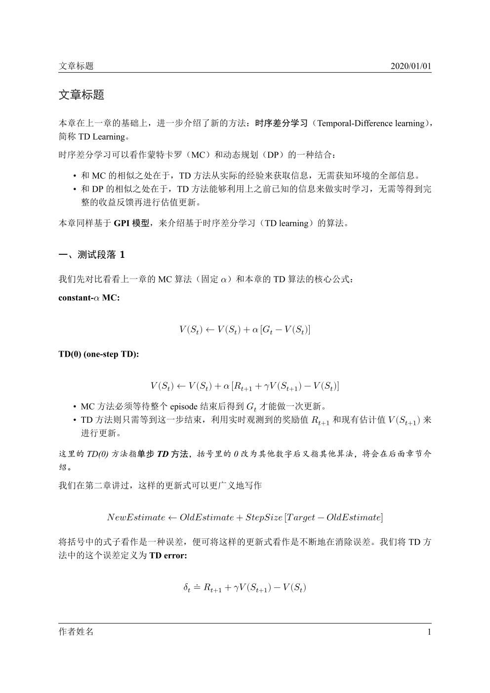

# Markdown 编译转换工具

Markdown 编译工具 / Simple toolkit for Markdown

Github: [zawnpn/Markdown_Toolkit](https://github.com/zawnpn/Markdown_Toolkit)

## 简介

基于`Pandoc`和`LaTeX`的快速markdown编译脚本工具

## Preview

|                         MD → Article                         |                         MD → Slide                          |
| :----------------------------------------------------------: | :---------------------------------------------------------: |
|  |  |

## 特点

- 方便快捷：只需要在mdtool命令后输入类别参数以及源文件名和输出文件名，即可快速生成PDF文件
- 路径识别：自动识别markdown源文件中图片、文件的相对路径，可在任意地方编译
- 备份防丢失：每次编译前，都会将markdown源文件备份至`~/.md_backup`文件夹中，起到checkpoint的作用，实时保存你的进度
- 自定义模板：可在md_template中自定义article模板
- 自定义Meta信息：可在markdown文件顶部的block区域添加标题、作者、日期以及中文字体等信息（使用范例请参考 [example/article/article.md](https://github.com/zawnpn/Markdown_Toolkit/blob/master/example/article/article.md) 和 [example/slide/slide.md](https://github.com/zawnpn/Markdown_Toolkit/blob/master/example/slide/slide.md)）
- 自定义LaTeX命令：可在markdown文件顶部的block区域添加你想使用的LaTeX命令，如`\usepackage{}`（使用范例请参考 [example/article/article.md](https://github.com/zawnpn/Markdown_Toolkit/blob/master/example/article/article.md) 和 [example/slide/slide.md](https://github.com/zawnpn/Markdown_Toolkit/blob/master/example/slide/slide.md)）

## 安装

首先需要安装好下列软件的最新版：

- `pandoc`: [https://pandoc.org/installing.html](https://pandoc.org/installing.html)
- `texlive`: [https://www.tug.org/texlive/](https://www.tug.org/texlive/)

安装好后，请按照软件说明添加路径到`PATH`中，确保能在终端中直接执行命令`pandoc`和`xelatex`。

之后，请将本项目clone至你本地任意目录，并添加至`PATH`（注意将`<path~to~Markdown_Toolkit>`替换为你的具体的`Markdown_Toolkit`路径）

```shell
git clone https://github.com/zawnpn/Markdown_Toolkit.git
chmod +x ./mdtool
echo 'export PATH=$PATH:<path~to~Markdown_Toolkit>' >> ~/.bashrc
source ~/.bashrc
```

## 使用

```shell
USAGE
    mdtool [-hv] [-sa] input_file output_file
OPTIONS
    -h                               print help information
    -v                               print version
    -s [input_file] [output_file]    build markdown in slide format
    -a [input_file] [output_file]    build markdown in article format
EXAMPLES
    mdtool -s slide.md slide.pdf
    mdtool -a article.md article.pdf
```
