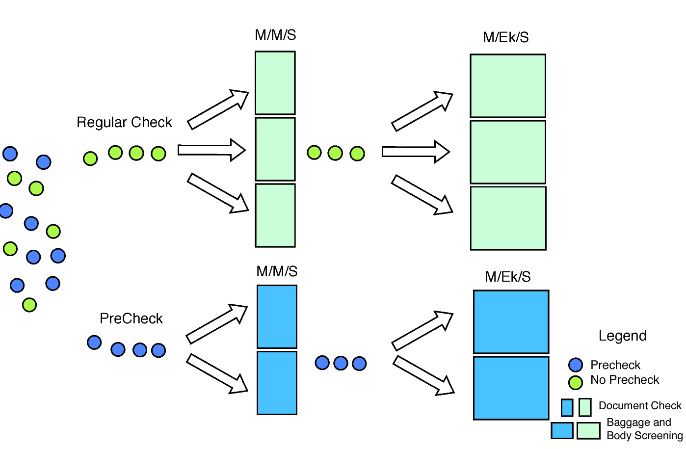
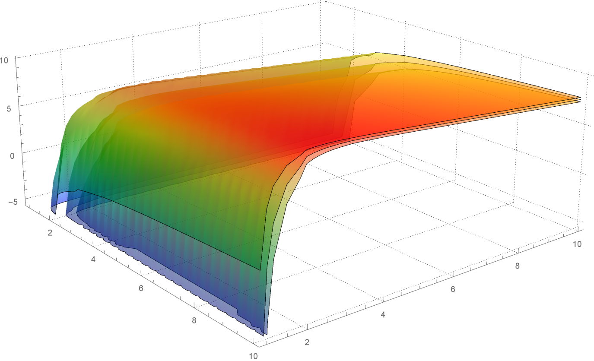

## 写在前面

在第一次挑战美赛前，我仅仅有着一次深圳杯和国赛的经验，一些技术还不够过关，加之英语不好，所以赛前真的挺紧张。

好在比赛时三人也算齐心协力，总算把论文鼓捣了出来，获不获奖已无所谓，有所收获就已经很满足啦。

今天恰逢博客运行一周年啦，总感觉应该写一点东西却又不知道写什么好，不如就趁机把这次美赛的一些思路整理整理放上来吧。

## 题目回顾

与去年一样，今年同样是三道MCM，三道ICM。

A题是解决修建大坝的一些问题，B题则要求针对收费站的分合流细节进行建模，C题题型是去年才新出的大数据型题目，大概是分析指定地区下，协作交通的一些问题。

后三道是ICM，D题要求分析机场安检系统，解决一下拥堵情况，E、F则属于脑洞比较大的题目了，一道是关于可持续的智慧型城市，另一道则是关于移民火星。

第一天大概六点左右，我们拿到了题目，三人按照之前的约定，先各自独立翻译一遍题目。这样做主要是为了加强审题，先建立好自己对题目的一些理解再一起讨论交流，避免被带偏方向。然而我自己并没有完成这项任务，只翻译了一篇就表示英语太渣翻不下去了，所以后面几题就只是仔细去看看。

第一天上午就是在讨论选题。我们首先豪不犹豫地排除了E、F题，毕竟要把这种题目理解好都不太容易，我们仨都没把握，索性干脆就不管这俩题了。

然后我们对A题讨论了蛮久，毕竟背景相当清晰明了。然而考虑到去年的“浴缸”题，仔细一想，这题目虽然背景明了，但是模型可非常模糊，有太多的流程、太多的细节和一些很有必要的数据，都需要我们自己来确定，稍有闪失或者考虑不周，最后出的结果可能会很“奇葩”。A题绝对对参赛者有着非常高的能力要求，所以我们对这道题只持保留意见。

其次排除了C题，这是一道大数据型的新题，最近两年才有，方向不太好把握，处理数据又是们专业活，做不好还不一定能出结果。

而B，D题真的就比较简单了（最后官方给出的参赛者选题情况也说明了这一点），甚至可以说有挺大的相似之处——都是对抽象意义上的微观交通流作分析、都是要处理和“拥堵”有一定关系的问题。

权衡之下，考虑到要想把B题做好，必须要做到能脱颖而出（料想到了选B的人会最多），所以我们选择了后者，D题。题目太长，就不具体重述了。（题目链接：[2017 MCM/ICM Problems](http://www.comap.com/undergraduate/contests/mcm/contests/2017/problems/ "2017 MCM/ICM Problems")）

## 模型思路

D题要求分析建立关于机场安检系统的模型，抽象分析这个过程，其实就好像一个个小物块要经过一些具体的服务流程，在这些流程中，可能会有一些等候，也就是具体的“堵”。

背景如此明了，三人都很快想到了运筹学中的“排队论”，再查阅一些文献资料，一些相似的问题也确实常在用排队论来解决。

> **排队论**（英语：queueing theory），或称随机服务系统理论、排队理论，是数学运筹学的分支学科。它是研究服务系统中排队现象随机规律的学科。广泛应用于电信，交通工程，计算机网络、生产、运输、库存等各项资源共享的随机服务系统，和工厂，商店，办公室和医院的设计。
>
> 排队论研究的内容有3个方面：统计推断，根据资料建立模型；系统的性态，即和排队有关的数量指标的概率规律性；系统的最佳化问题。其目的是正确设计和有效运行各个服务系统，使之发挥最佳效益。[1]

排队论的具体模型常用形如A/B/C的表达式来表示，其中各自的意义如下

$$\begin{array}{c|l}\hline字母 & 意义 \\\hline A & 到达的规则 \\B & 服务规则，即服务时间长短服从的规律\\C & 服务台个数\\\hline\end{array}$$

首先分析一下题目给出的数据，对到达时间作了如下的$\chi^2$检验，发现输入的乘客流到达时间分布服从Poisson分布：$p(k | \lambda , t)=\dfrac{e^{-\lambda t}(\lambda t)^k}{k!}$

$$\begin{array}{c|c|c|c}\hline n & f_n & e_n & (f_n-e_n)^2/e_n \\\hline0&3&3.27&0.0223\\1&6&6.9&0.1181\\2&9&7.29&0.403\\3&3&5.13&0.8827\\4&6&4.41&0.5703\\\hline \sum &27&27&1.9964\\\hline\end{array}$$

作相似的分析，可以发现，服务台的服务时间服从Erlang分布：$f(t | \mu , k)=\dfrac{(\mu k)^k}{(k-1)!}t^{k-1}e^{-k\mu t}$

再结合具体的流程，最终我们确定了基本的排队模型——将每个小环节抽象为M/Ek/S模型（特别地，柜台流程其实是M/M/S模型，是M/Ek/S模型的一种，令k=1即可），再将两个这样的模型（S可不相同）串联起来，分别表示实际中先后的柜台流程和行李扫描流程。最后根据题意，将服从Poisson分布的乘客流分流后，分别通过Pre-Check和Regular-Check的排队模型，这样构成了这次建模的总体框架。

具体的计算和证明就不详细描述了，下面结论性地给出在M/M/S系统中的平均等待时间

> $$W_{q1}(\lambda,\mu,s)=\dfrac{1}{\left(\mu  s \left(1-\frac{\lambda }{\mu  s}\right)^2\right) }\left(\sum _{j=0}^{s-1} \frac{\left(\frac{\lambda }{\mu }\right)^j}{j!}+\frac{\left(\frac{\lambda }{\mu }\right)^s}{s! \left(1-\frac{\lambda }{\mu  s}\right)}\right)^{-1}$$

和M/Ek/S系统中的平均等待时间

> $$W_{q2}(\lambda,\mu,s,k)=\dfrac{k+1}{\left(2 k \mu  \left(s-\frac{\lambda }{\mu }\right)\right) }\left(\sum _{i=0}^{s-1} \frac{(s-1)! \left(s-\frac{\lambda }{\mu }\right)}{i! \left(\frac{\lambda }{\mu }\right)^{s-i}}+1\right)^{-1}$$

其中，$\lambda$表示平均到达率 (the number of arrival passengers in unit time )，$ \mu$表示 平均服务率 (the number of passengers who receive service in unit time)，s如前文所述，表示服务台数，k则是Erlang分布的一个参数

得到了等待函数，那接下来就有很多事可以做了。

## 模型分析

首先我们对W求偏导，并画了些动态图，可以明确确定，该模型下，等待函数W对第二个环节（安检扫描行李）更敏感，具体点讲就是增加同样的服务时间$\mu$，$W_{q2}$比$W_{q1}$增加得更快，所以可以定性地说，拥堵问题更多地出自第二个环节

然后画出W关于s1，s2的等高线图，如下（颜色越深表示高度越低，$\mu$的结果类似），可以用来分析服务台数的改变能够对W带来怎样的影响，比如可以说明s1，s2要均衡增加才能带来更好的效益

（图中还有一条拟合曲线，它是后期做条件规划时针对该情况画上去的，可以看出，曲线拟合情况比较令人满意）

题目中着重强调了Pre-Check，所以将它与常规的安检结合起来是必要且非常重要的。用p表示走常规安检的客流比率，作出W关于$\mu_2'$（Pre-Check下的第二环节服务率）和p的图，如下

这张图很有意思，可以看出，p有一个比较合适的范围区间，意味着过分地开放Pre-Check也不是一件好事，同时，$\mu_2'$也不能设得太慢，否则W会陡增

诸如此类的细节分析还有很多，也不具体描述了。当然，光有分析还不够，因此我们利用得出的结论，将他们通过一些创新点实现了出来，如下图所示

比如增加电子化的服务设施，其实就是降低一定的$\mu$，再比如贴心地增加电子屏幕，引导乘客有序更快地进入排队系统，同时还能合理分配服务资源，避免服务资源闲置，诸如此类的还有增加“快速无行李乘客通道”、“绿色通道”、增加传送带长度等具体措施。

## 灵敏度分析

最后，则是非常非常重要的灵敏度分析，我们的思路是作出效用函数U（就不具体描述了，是一个综合权衡机场的效益和乘客的满意度、容忍度以及题目谈到的文化差异的函数）关于一些参量的3D图，如下所示

从这两张图可以得出非常多的结论，比如，第一张图中，越往远端走，三张曲面分得越开，此时说明U对对应的参量越敏感，而近端则贴合得比较好，所以为了控制好灵敏性，参数也需要设定在一定的范围，或者，换个思路，不同的参数代表不同的机场（可以是机场大小不同、所处文化不同等等），那么不同的机场应该如何面对差异带来的变动呢，这两张图就能给出一些很具体的指导结论。

由于这些结论的一些前提没有在这篇博文里详细介绍，所以就不再描述了。

## 仿真

此外，我们还做了一点仿真，这个仿真是关于M/Ek/S模型的仿真。如前文所述，我们得到了具体的W表达式，但在求解过程中，我们采用了一些近似求解，为了进一步论证我们的模型是比较贴近实际的，我们结合数据，利用MATLAB程序和蒙特卡洛算法做了一下仿真，下面贴张仿真结果图

以及误差表

> $$\begin{array}{c|cccccc|c}\hline &1&2&3&4&5&6 &Average\\   \hline     W_q  \ (s)&7.0276&6.9588&6.2406&6.2914&7.4669&6.5186&6.7971\\   Error\ (\%)&2.00&1.00&9.43&8.69&8.37&5.39&5.90\\   \hline \end{array}$$

总体波动不大，平均误差率只有5.90%，这些都在可接受误差范围内。

## 参考网站

1.[排队论-维基百科](https://zh.wikipedia.org/wiki/%E7%AD%89%E5%80%99%E7%90%86%E8%AB%96 "排队论-维基百科")

2.[MCM/ICM Problems](http://www.comap.com/undergraduate/contests/mcm/contests/2017/problems/ "MCM/ICM Problems")

## 写在最后

感谢子杰，感谢宜楠学姐，真的是神一般的队友呀！四天的艰辛真的很有收获，无论是对一些技术的“速成”，还是思维碰撞带来的思考方式的转变等等，都让我提升了很多、学会了很多。感谢！
