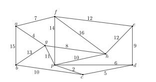
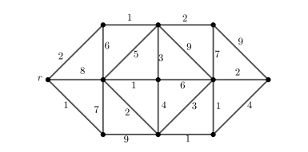

回忆：万昶宏 &emsp; 整理：[lzh](https://github.com/Alexhaoge)
1. 名词解释（40分）
- 最短路问题
- 最小生成树问题
- 旅行售货商问题
- 多项式时间算法
2. 求下图的最小生成树（15分）

3. 求下图中顶点r到所有顶点的最短路及其权重（20分）

4. 叙述现实生活中的一个离散优化问题，介绍本问题涉及的离散优化知识，并举例进行求解（25分）

注：离散优化是组合数学中心的史永堂老师今年第一年开的课，显然期末考试没有难为大家。这门课由多位老师授课，史老师还会请校外的老师作报告，涉及图论、网络流、计算复杂性理论、随机算法、机器学习在离散优化中的应用等，内容丰富，值得选修。