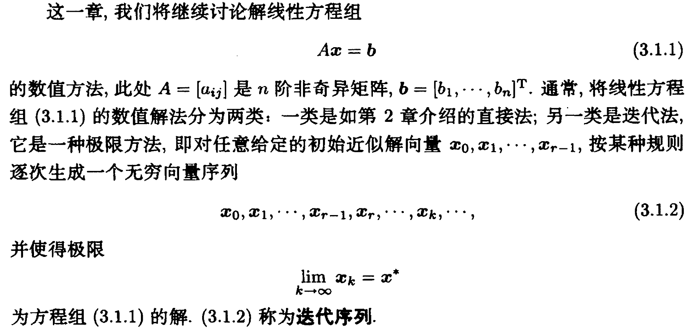
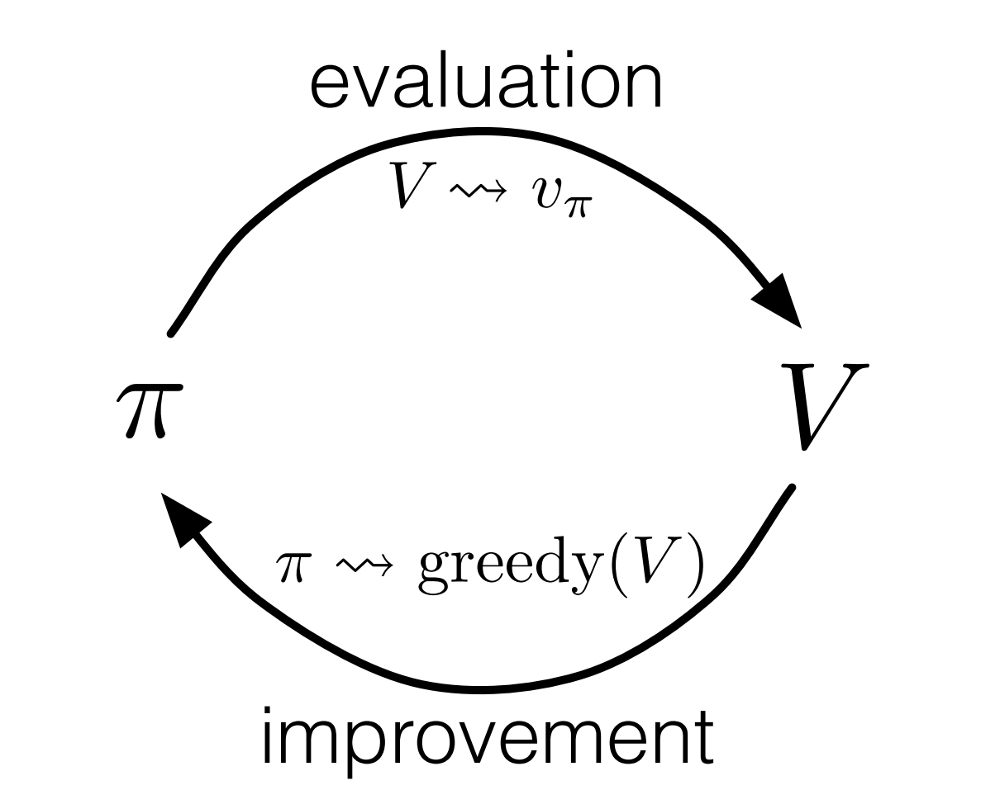

# 强化学习导论（四）- 动态规划

本章内容较少，主要是解决上一章提出的贝尔曼方程不适合直接求解的问题。

**Dynamic Programming (DP)**:

在本书中，动态规划（DP）特指「给定理想 MDP 模型后用于计算最优策略的算法集合」。

**Dynamic Programming (From Wiki)**:

在 Wiki 上，动态规划的解释为「通过把原问题分解为相对简单的子问题的方式求解复杂问题的方法」。

### DP 的核心思想

本章中，DP 的核心思想体现在将上一章讲的贝尔曼方程作为**更新规则**，通过**迭代求解法**得到近似解。

$$
\begin{aligned}v_*(s) &= \max_a \mathbb{E}[R_{t+1}+\gamma v_*(S_{t+1}) \mid  S_t=s,A_t=a] \\ &= \max_a \sum_{s',r}p(s',r\mid s,a)[r+\gamma v_*(s')] &(4.1)\end{aligned}
$$

$$
\begin{aligned}q_*(s,a) &= \mathbb{E} [R_{t+1} + \gamma \max_{a'} q_*(S_{t+1},a') \mid S_t=s, A_t=a] \\ &= \sum_{s',r}p(s',r \mid s,a)[r+\gamma \max_{a'} q_*(s',a')]&(4.2)\end{aligned}
$$

## 4.1 Policy Evaluation

### 目标

**给定 $\pi$ ，如何更快地计算 $v_\pi$ ？**

$$
\begin{aligned}v_\pi(s) &\doteq \mathbb{E}_\pi[R_{t+1}+\gamma R_{t+2}+ \gamma^2 R_{t+3}+ \cdots \mid S_t = s] \\ &= \mathbb{E}_\pi[R_{t+1}+\gamma v_\pi(S_{t+1}) \mid S_t=s] &(4.3)\\ &=\sum_a\pi(a\mid s)\sum_{s',r}p(s',r\mid s,a)[r+\gamma v_\pi(s')] &(4.4)\end{aligned}
$$

- 如果我们已知 $p(s',r|s,a)$ ，那么 (4.4) 式为其实就是一个线性方程组（$|\mathcal{S}|$ 个方程、 $|\mathcal{S}|​$ 个未知元）。
- 这个方程组是能直接求解得出的，但是速度太慢，不实用。

### 思路

**通过迭代求解法，找到序列 $\{v_k\}$ 使得 $\lim\limits_{k\to\infty}v_k=v_\pi$.**

我们采用 $v_\pi$ 的贝尔曼方程作为更新规则：

$$
\begin{aligned}v_{k+1}(s) &\doteq \mathbb{E}_\pi[R_{t+1}+\gamma v_k(S_{t+1}) \mid S_t=s] \\ &= \sum_a\pi(a\mid s)\sum_{s',r}p(s',r \mid s,a)[r+\gamma v_k(s')]\end{aligned}
$$

方程的系数我们简记为 $c_{ij}$，此外还有常数项，记为 $b_i$：

$$
\begin{aligned}
v_{k+1}(s_1)=&c_{11}v_k(s_1)+c_{12}v_k(s_2)+\cdots+c_{1n}v_k(s_n)+b_1\\
v_{k+1}(s_2)= & c_{21}v_k(s_1)+c_{22}v_k(s_2)+\cdots+c_{2n}v_k(s_n)+b_2\\
&\vdots\\
v_{k+1}(s_n)= & c_{n1}v_k(s_1)+c_{n2}v_k(s_2)+\cdots+c_{nn}v_k(s_n)+b_n\\
\end{aligned}
$$

进一步地，我们可以把贝尔曼方程及其迭代法更新规则表示为以下的向量化形式：

$$
\begin{aligned}
\vec{\mathbf{v}}&=\mathbf{C}\vec{\mathbf{v}}+\vec{\mathbf{b}} \quad\left(\mathbf{I}-\mathbf{C}\right)\vec{\mathbf{v}}=\vec{\mathbf{b}}\\
\vec{\mathbf{v_{k+1}}}&=\mathbf{C}\vec{\mathbf{v_k}}+\vec{\mathbf{b}}
\end{aligned}
$$

在「数值分析」中，这样的方法叫 **Jacobi 迭代求解法**：

> 

可以看出，我们之前给出的向量化形式，正是迭代法所讨论的问题。而我们可以通过下面的定理来确保我们的迭代极限确实能够收敛到真实解：

> 

前两个定理描述的是迭代法收敛的**充要条件**，其条件有点强，不容易看出，而第三个定理只是一个**必要条件**，所以条件要求得比较弱，只需找到一个矩阵范数能使我们的系数矩阵范数小于 1 即可（$||C||<1$）。

我们可以考虑「无穷范数」：

$$
||C||_\infty=\max\limits_{1\leq j\leq n}\sum_{i=1}^m|c_{ij}|
$$

其含义是矩阵的 **元素绝对值的行和最大值** ，显然，我们的 $c_{ij}$ 是由概率 $\pi, p$ 以及削减率 $\gamma (0\leq \gamma < 1)$ 相乘而得，我们先不看削减率，由于状态和行动的独立性，两个概率相乘即为联合分布（关于 s,a）。我们对一行求和，显然只包含到了部分情况，进而显然概率之和小于等于 1 （注意特殊情况下仍有可能为 1，此时恰好只有这一行的 (s,a) 对应的事件能够发生，其他行的概率均分别为0），再乘上削减率 $\gamma$ ，于是显然有 $||C||_\infty < 1$，于是迭代序列收敛到真实解，因此这个方法是正确合理的。

### 算法 (Iterative Policy Evaluation)

1. 给定初始值 $v_0(s)$
2. 使用贝尔曼方程作为更新规则，通过更新 $v_k$ 来得到 $v_{k+1}$
3. 直到 $\max\limits_{s \in \mathcal{S}}\mid v_{k+1}(s)-v_k(s)\mid < \theta$ 时停止迭代

- 同步法: 使用两个数组 `v_k[]` 和 `v_k+1[]`，其中 `v_k+1[]=Bellman(v_k[])`，更新时不对旧数组 `v_k[]` 作任何改动，能够确保完全按照我们的公式逐步更新。
- In-Place 法: 只使用一个数组 `v[]`，每轮更新产生更新值时直接覆写在旧值上。这样就会导致下一次更新时，本应该按照公式用旧值更新另一个值，结果发现这个值已经被之前的更新给覆写上去了。

In-Place 法仍然能够确保收敛到 $v_\pi$ ，而且速度更快。事实上，这种迭代规则仍然是数值分析中的一种迭代求解法，叫做「**Gauss-Seidel 迭代法**」：

> 

关于这种方法不再详细说明。

## 4.2 Policy Improvement

### 目标

**给定 $\pi$ 和 $v_\pi$ ，如何改进策略以得到一个更优的 $\pi'$ ？**

### 思路

先摆结论，我们要通过下面这样的贪心方法来对策略 $\pi$ 做小改进：

$$
\begin{aligned}\pi'(s) &= \mathop{\arg\max}\limits_a q_\pi(s, a)\\&=\mathop{\arg\max}\limits_a \mathbb{E}[R_{t+1}+\gamma v_\pi(S_{t+1})\mid S_t=s,A_t=a] \\&= \mathop{\arg\max}\limits_a \sum_{s',r} p(s', r | s, a) (r + \gamma v_\pi(s'))\end{aligned}
$$

上面所要表达的意思是，仅在状态 s 下对策略进行微小的改进，其他状态仍保持原策略，那么总体上来讲，直观上显然新策略 $\pi'$ 更优，即有 $v_{\pi'}(s)\geq v_\pi(s)(\forall s \in \mathcal S)$，下面给出证明。

### Policy Improvement Theorem

**如果 $q_\pi(s, \pi'(s)) \geq v_\pi(s)  ,\forall s\in\mathcal S$, 可证得 $v_{\pi'}(s) \geq v_\pi(s)$** 。

$$
\begin{aligned}
q_{\pi}(s,a)&\doteq\mathbb{E}_{\pi}\left[G_t|S_t=s,A_t=a\right]=\mathbb{E}_{\pi}\left[R_{t+1}+\gamma v_\pi(s)|s,a\right]\\
v_\pi(s) &\leq q_\pi(s, \pi'(s)) \\ &=\mathbb{E}_\pi[R_{t+1}+\gamma v_\pi(S_{t+1}) \mid S_t=s,A_t=\pi'(s)]\\&= \mathbb{E}_{\pi'}[R_{t+1}+\gamma v_\pi(S_{t+1}) \mid S_t=s] \\ &\leq \mathbb{E}_{\pi'}[R_{t+1}+\gamma q_\pi(S_{t+1},\pi'(S_{t+1}))\mid S_t=s] \\&= \mathbb{E}_{\pi'}[R_{t+1}+\gamma \mathbb{E}_{\pi'}[R_{t+2}+\gamma v_\pi(S_{t+2})] \mid S_t=s] \\ &= \mathbb{E}_{\pi'}[R_{t+1}+\gamma R_{t+2}+\gamma^2v_\pi(S_{t+2}) \mid S_t=s] \\ &\leq \mathbb{E}_{\pi'}[R_{t+1}+\gamma R_{t+2}+\gamma^2R_{t+3}+\gamma^3v_\pi(S_{t+3})\mid S_t=s] \\ &\vdots \\ &\leq \mathbb{E}_{\pi'}[R_{t+1}+\gamma R_{t+2}+\gamma^2R_{t+3}+\gamma^3R_{t+4}+\cdots \mid S_t=s]\\&=\mathbb{E}_{\pi'}[G_t|S_t=s]  \\ &=v_{\pi'}(s)
\end{aligned}
$$

## 4.3 Policy Iteration

### 目标

既然是讲动态规划，显然前面就是在解决子问题了，这一节便要开始考虑回归原本的问题：「**如何得到全局最优策略 $\pi_*$ ？**」

### 思路

我们反复交替执行进行前两节的两种算法：

$$
\pi_0 \xrightarrow{E} v_{\pi_0} \xrightarrow{I}\pi_1 \xrightarrow{E} v_{\pi_1} \xrightarrow{I} \pi_2 \xrightarrow{E} \cdots \xrightarrow{I} \pi_* \xrightarrow{E} v_*
$$

- $\xrightarrow{E}$: Policy Evaluation
- $\xrightarrow{I}$: Policy Inprovement
- 由于在有限 MDP 中，整个定义空间都是有限的，策略也必然是有限的，在我们的交替过程中，值函数单调上升且显然有上界，由定理可知，这个过程执行一定步数后，策略必然能收敛到最优策略。

### 算法 (Policy Iteration)

## 4.4 Value Iteration

### 目标

在我们上一节讲的策略迭代算法中，每次迭代中又都包含一个「策略估计（policy evaluation）」迭代，可想而知这严重拖慢了算法速度，因此我们还得改进算法。

### 思路

Policy evaluatoin 的慢体现在他要扫描不断整个状态集，确保精确性，其实我们可以考虑不做这么精准的「估计（evaluation）」，而是每一步（每次处理一个状态）都同步进行 evaluation 和 improvement，也不再以策略是否稳定为标准，而是看总的上界是否收敛。

$$
\begin{aligned}v_{k+1}(s) &\doteq \max_a \mathbb{E}[R_{t+1}+\gamma v_k(S_{t+1}) \mid S_t=s, A_t=a] \\ &= \max_a \sum_{s',r}p(s',r \mid s,a)[r+\gamma v_k(s')], \forall s \in \mathcal S &(4.10)\end{aligned}
$$

看似这样做很暴力不讲道理，但其实依然是有依据的，在上一章中，我们讲到贝尔曼最优方程：

$$
\begin{aligned}v_* &= \max_a \mathbb{E}[R_{t+1}+\gamma v_*(S_{t+1}) \mid S_t= s,A_t=a] \\ &= \max_a \sum_{s',r}p(s',r \mid s,a)[r+\gamma v_*(s')]\end{aligned}
$$

可以看出，我们这一节提出的「值迭代（value iteration）」的迭代公式其实就是贝尔曼最优方程的更新式，而且同样可以类似前面证明，对这个公式做迭代法也是能收敛的。

### 算法 (Value Iteration)

## 4.5 Asynchronous Dynamic Programming

### 目标

之前讲到的 DP 方法都还有一个问题，那就是他们都会遍历整个状态集。如果状态集特别大，即使是改进后的 value iteration 也会很慢。这一节简单提一提如何采用**异步动态规划**来解决这一问题。

### 思路

在 value iteration 的基础上，更激进地，我们优先更新我们认为值得更新的状态，而不是像之前那样「同步 / 无差别」更新。

举个例子，比如下棋，一些局势基本上不太可能会出现，我们就可以认为这样的状态不值得频繁更新，而应把计算资源集中在那些经常出现的局面上，让我们的模型在大概率出现的局面上能够采取最优解，而在那些低概率出现的局面上仅采取一个较为合适的「局部最优解 / 较优解」，这样在**期望意义下**我们仍能拿到一个不错的收益，但却解决了计算能力不足的问题。

### 算法特点

- 能够灵活选择我们所想要多去更新的状态，同时在大部分情况下也能收敛到最优解
- 在每个状态下，我们利用 (4.10) 式来对状态 $s_k$ 进行更新，此时，$v_k \to v_*$ 当且仅当 **全部状态都在 $\{s_k\}$ 中出现了 $\infty$次** $(0 \leq \gamma <1)$ 。可以看出，若想得到全局最优解，这个算法没法做到本质上的速度提升，但是正如前面所讨论的，我们可以通过灵活更新，提前停止迭代，一样能够达到一个较好的整体策略。

## 4.6 Generalized Policy Iteration (GPI)

**GPI：「策略估计」与「策略改进」相交互的一种通用描述模型。**

举两个例子：

- 在 policy iteration 中，我们是把两个过程（估计、改进）当作独立过程，分别执行再进行联立，这种方法就属于典型的 GPI 。
- 在异步 DP 方法种，两个过程被高度整合在一起，这同样属于 GPI 。

**几乎所有的强化学习方法都能很好地被描述为 GPI 模型。**

上图可以这样解读：

- GPI 可以看作是「竞争」和「协作」共存的模型。
- 竞争：现有策略通过贪心方法进行改进后，值函数不再精准；修改策略之后，重新估算值函数，使得原有的改进策略变得正常、合理，显得不「贪心」。
- 协作：两个过程相互促进，最后达到了共同点，也就是全局最优解。

## 4.7 Efficiency of Dynamic Programming

最后再简要提一提我们这章讲的 DP 算法的效率。

**算法复杂度**：

- 直接搜索： $O(k^n)$ (n 种状态，k 种行动)
- 动态规划： $O(c^n+c^k)$ (c 是与 n、k 无关的常数)

**总结**:

- DP 方法在面对特别大规模的问题仍然不适用，主要是因为维度灾难（curse of dimensionality）。但相比上一章的直接求解或者暴力搜索，仍然有着非常大的提升。
- 以今天的计算机，DP 算法足以用来处理百万数量级 states 的 MDP 问题。