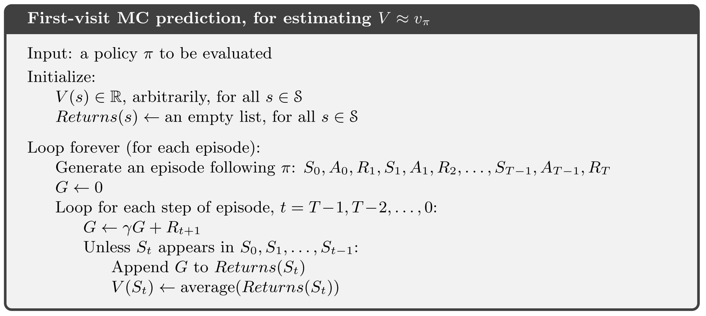
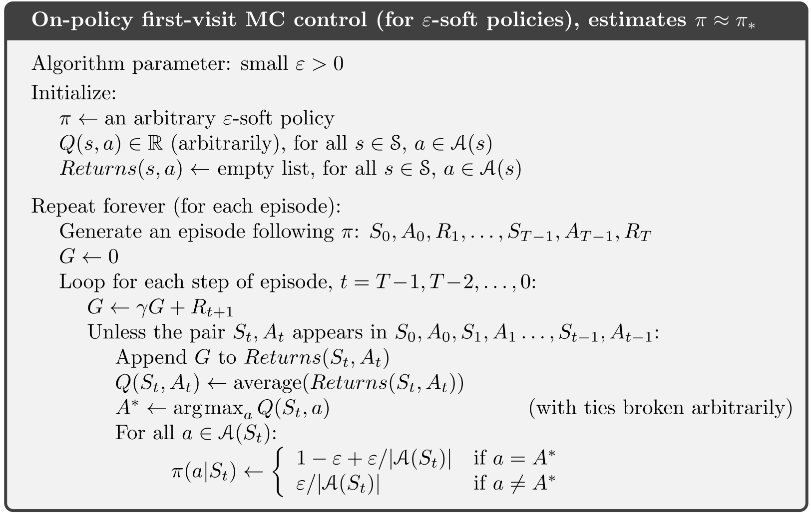
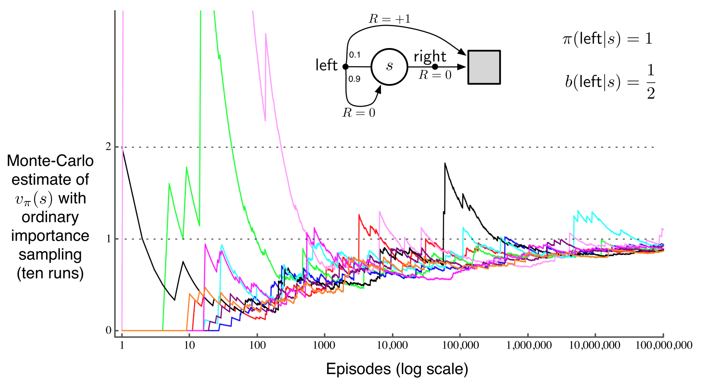

# [读书笔记]Reinforcement Learning: An Introduction - Chapter 5

本章主要讲强化学习中的蒙特卡罗方法。

**Monte Carlo Methods([Wiki](https://zh.wikipedia.org/wiki/%E8%92%99%E5%9C%B0%E5%8D%A1%E7%BE%85%E6%96%B9%E6%B3%95))**:

蒙特卡罗方法，也称统计模拟方法，是1940年代中期由于科学技术的发展和电子计算机的发明，而提出的一种以概率统计理论为指导的数值计算方法。是指使用随机数（或更常见的伪随机数）来解决很多计算问题的方法。

**Monte Carlo Methods**:

在本书中，蒙特卡罗方法具体指**基于样本返回值的均值，用于解决强化学习问题的方法**。

由于蒙特卡罗方法基于样本返回值来解决问题，所以需要得到明确的反馈值，因此本章主要基于片段式任务（episode tasks）进行探讨（并且 $\gamma=1$），以 episode 为单位，当一个片段结束，才去通过整个片段的反馈来进行相应调整。

## 5.1 Monte Carlo Prediction

在我们使用蒙特卡罗方法估计 return 时，一般有两种主要的统计方法：

- **first-visit MC method**：

在**一个 episode 中**，对于每个状态 s （或「状态-行动组合」 s-a），只考虑第一次进入 s （或 s-a）之后的 return 来对 $v_\pi(s)$ (or $q_\pi(s,a)$) 进行估计，往后再遇到 s（或 s-a）则不再统计。

- **every-visit MC method**：

every-visit 总体与 first-visit 相似，唯一的差别在于，在一个 episode 中，所有以 s （或 s-a） 为出发点的 episode 都会对其 return 进行统计，进而用于估计 $v_\pi, q_\pi$ 。

根据大数定律，容易分析知，他们均能收敛到 $v_\pi(s)$。

在一些牌类游戏中，原则上我们是可以将其视作有限 MDP 问题，比如我们将每局牌视作一个 episode ，然后根据「赢 / 输 / 平」给定奖励值 +1 / -1 / 0 ，然后就按我们之前讲的方法来做。

然而实际操作中，我们很难求出这个问题背景下的「状态转移概率」，简单而言，即使我们完全清楚环境的变化机制 $p(s',r|s,a)$ ，也很难把问题背景理解「透彻」，我们很难一一分析列举出所有可能的情况，以及他们之间的关系（虽然理论上是肯定可以穷举出来的），所以需要用到蒙特卡罗方法直接根据大量「经验」来暴力估计出我们想要的东西。通俗地讲，就是：「我们虽然没有去具体分析环境的变化机制，但是不用想那么多，照着以前的经验做就是了」。

## 5.2 Monte Carlo Estimation of Action Values

### 问题

如果给定一个策略，在这个策略下去模拟，可能会有不少「状态-行动组合（state-action pair）」从来没尝试过，也就是某些状态的样本量可能为 0 ，对于随机模拟方法而言，这样估计出来的东西显然会有偏差，就像第二章讨论的那样，得多做一些「探索（exploration）」。

### 思路

**exploration start**:

既然策略 $\pi$ 是给定的，在模拟过程中，基于这个策略一步一步行动下去，我们很难改变什么，唯一能任意指定的，就是初始状态，所以在生成模拟片段时，可以考虑随机指定任意状态为初始状态，这样只要我们生成的模拟片段足够多，一样能确保每个状态都能被我们访问足够多次。我们称这样指定的初始状态为 **exploration start** 。

不过，这个方法有相当大的局限性：

- 在一些特殊情况下，我们必须得跟环境交互才能学习策略，这时候便不能指定初始状态了
- 操作起来麻烦，而且依然考虑得不够全面

## 5.3 Monte Carlo Control

### 目标

通过蒙特卡罗方法来估计最优策略。

### 方法

上一章讲过，GPI 模型非常通用，能够描述绝大多数强化学习方法，而这一章我们依然是基于 GPI 模型，通过「值的估计」和「策略改进」这两个环节交替作用，最终得到最优策略。

$$
\pi_0 \xrightarrow{E} q_{\pi_0} \xrightarrow{I}\pi_1 \xrightarrow{E} q_{\pi_1} \xrightarrow{I} \pi_2 \xrightarrow{E} \cdots \xrightarrow{I} \pi_* \xrightarrow{E} q_*
$$

-   Policy evaluation: 使用蒙特卡罗方法来根据经验模拟估计，而不是像上一章的方法直接计算。这一小节的算法需要有 **exploring start** 。

-   Policy improvement: 跟上一章一样，采用贪心策略来改进当前策略 $\pi(s)\doteq \max\limits_aq(s,a)$ 。

### Monte Carlo ES (Monte Carlo with Exploring Starts)

下面是带有「探索初始态」的蒙特卡罗方法的伪代码：

## 5.4 Monte Carlo Control without Exploring Starts

### 目标

之前提到，exploration start 这样的条件，仍然有不少缺点，缺乏泛用性，我们需要其他的办法。

### 方法

我们先提两个概念：

-   On-policy: 直接对我们的决策策略进行估值和改进。

-   Off-policy: 结合一个其他的策略，来对我们的决策策略进行估值和改进。

这一小节我们先讲 On-policy 。

在 On-Policy 方法中，我们的策略一般得是「**soft**」的： $\pi(a|s)>0, \forall s \in \mathcal S, a\in\mathcal A(s)$。直白点讲，就是所有的情况都要被考虑到，即使某个 action 并不优秀，也不能直接将其选取概率设为 0 ，这样的策略显得不那么绝对，体现出一种「趋势性」：好的 action 更容易被选上，不好的 action 也有一定的机会。

**$\varepsilon$-soft policy**:

- 若 a 为非贪心策略（exploration），则 $\pi(a|s)=\frac{\varepsilon}{|\mathcal A(s)|}$

- 若 a 为贪心策略（exploitation），则 $\pi(a|s)=1-\varepsilon + \frac{\varepsilon}{|\mathcal A(s)|}$

### On-policy first-visit MC control

基于 On-policy 方法，我们可以给出下面的算法来估计最优策略：

**policy improvement theorem**:

GPI 模型并不要求我们的策略全程都是贪心策略，只需要「渐渐变得贪心」就可以了，在我们上面的算法中，我们的 $\varepsilon$-soft 策略会渐渐变成一个 $\varepsilon$-greedy 策略，并且可以证明，通过贪心方法确实能够改进 $\varepsilon$-soft 策略，证明如下：

设 $\pi'$ 为贪心改进后的策略，则有

$$
\pi'(a|s)=
\begin{cases}
\frac{\varepsilon}{|\mathcal A(s)|}&, \mathrm{non-greedy}\\
1-\varepsilon-\frac{\varepsilon}{|\mathcal A(s)|}&, \mathrm{greedy}
\end{cases}
$$

而原本的 $\varepsilon$-soft 策略 $\pi$，我们记其概率分布为

$$
\pi(a_i|s)=
\begin{cases}
\frac{\varepsilon}{|\mathcal A(s)|}+\delta_i&,a_i\neq a_*\\
1-\frac{(|\mathcal A(s)|-1)\varepsilon}{|\mathcal A(s)|}-\sum_{a_i\neq a_*}\delta_i&,a_i=a_*
\end{cases}
$$

接下来，可得

$$
\begin{aligned}
v_{\pi'}(s)&=\sum_a
\pi'(a|s)q_\pi(s,a)\\
&=\frac{\varepsilon}{|\mathcal A(s)|}\sum_aq_\pi(s,a)+(1-\varepsilon)\max\limits_aq_\pi(s,a)
\end{aligned}
$$

记 $M=\max\limits_aq_\pi(s,a)$，我们先证明不等式 $\displaystyle \max\limits_aq_\pi(s,a)\geq\sum_a\frac{\pi(a|s)-\frac{\varepsilon}{|\mathcal A(s)|}}{1-\varepsilon}q_\pi(s,a)$：

$$
\begin{aligned}
&\sum_a\frac{\pi(a|s)-\frac{\varepsilon}{|\mathcal A(s)|}}{1-\varepsilon}q_\pi(s,a)\\
&=\frac{\pi(a_*|s)-\frac{\varepsilon}{|\mathcal A(s)|}}{1-\varepsilon}M+\sum_{a_i\neq a_*}\frac{\pi(a_i|s)-\frac{\varepsilon}{|\mathcal A(s)|}}{1-\varepsilon}q_\pi(s,a_i)\\
&= \frac{1-\frac{(|\mathcal A(s)|-1)\varepsilon}{|\mathcal A(s)|}-\sum_{a_i\neq a_*}\delta_i-\frac{\varepsilon}{|\mathcal A(s)|}}{1-\varepsilon}M+\sum_{a_i\neq a_*}\frac{\delta_i}{1-\varepsilon}q_\pi(s,a_i)\\
&=\frac{1-\varepsilon}{1-\varepsilon}M-\frac{1}{1-\varepsilon}\sum_{a_i\neq a_*}\delta_iM+\frac{1}{1-\varepsilon}\sum_{a_i\neq a_*}\delta_iq_\pi(s,a_i)\\
&=M-\frac{\sum_{a_i\neq a_*}\delta_i}{1-\varepsilon}(M-q_\pi(s,a_i))\\
&\leq M=\max\limits_aq_\pi(s,a)
\end{aligned}
$$

将不等式代回前面，得到

$$
\begin{aligned}
v_{\pi'}(s)&\geq\frac{\varepsilon}{|\mathcal A(s)|}\sum_aq_\pi(s,a)+(1-\varepsilon)\sum_a\frac{\pi(a|s)-\frac{\varepsilon}{|\mathcal A(s)|}}{1-\varepsilon}q_\pi(s,a)\\
&=\frac{\varepsilon}{|\mathcal A(s)|}\sum_aq_\pi(s,a)-\frac{\varepsilon}{|\mathcal A(s)|}\sum_aq_\pi(s,a)+\sum_a\pi(a|s)q_\pi(s,a)\\
&=v_\pi(s)
\end{aligned}
$$

所以得出结论，对策略 $\pi$ 做出题述的改进后得到的  $\pi'$ 确实要优于 $\pi$ 。

## 5.5 Off-policy Prediction via Importance Sampling

### 目标

在我们的问题中，目标策略经常是**确定性**的贪心策略（与 soft 相对，确定性策略选出的 action 很确定），这种情况下，我们若要使用 On-policy ，不得不又重新考虑 exploration start ，为了避免这个情况，我们要考虑一种 Off-policy 的方法。

与 On-policy 不同的是，我们去学习一个最优策略，并不一定要在调整这个策略的同时也跟着它走，这一节采用的 Off-policy 方法则是用一个「行为策略」来生成行动，来对我们的「目标策略」进行优化，这样的一个好处是，我们可以通过辅助性的行为策略来做出探索行动，而我们要学习的目标策略，就不用再因 exploration 而不得不加入一些不那么好的行动。

而将两个策略分开最重要的好处，正是我们可以通过 soft 的行为策略去生成探索 action ，而目标策略则保持「确定性」，解决了前面提出的问题，进一步加强了算法的泛用性。

-   目标策略 ($\pi$): 被学习的策略

-   行为策略 ($b$): 用来再学习过程中生成 actions 的策略

行为策略需要是完全已知的，并且需要能被目标策略**覆盖**：$\pi(a|s)>0\Rightarrow b(a|s)>0$ ，即目标策略所有可能采取到的行动，在行为策略中其被选取的概率也必须大于 0 。

### 原理

**重要性采样**:

重要性采样（importance sampling）是统计学中估计某一分布性质时使用的一种方法。该方法从与原分布不同的另一个分布中采样，而对原先分布的性质进行估计。

易知，

$$
\begin{aligned}
\mathbb E_f[x] &= \int xf(x)\mathrm{d}x\\
&= \int \frac{xf(x)}{g(x)} g(x)\mathrm{d}x\\
&= \mathbb E_g [\frac{f(x)}{g(x)}x]
\end{aligned}
$$

我们称 $\rho=\frac{f(x)}{g(x)}$ 为重要性采样比例，这样，对于一个未知的分布 $f$ ，若已知分布 $g$ ，并且能求出比值 $\frac{f(x)}{g(x)}$ ，便能方便地在 $g$ 分布下对 $x$ 进行估计。

在我们这个问题中，因为有状态条件，所以应该求条件期望，易分析知条件期望同样适用：

$$
\begin{aligned}
\mathbb{E}_f[x|S=s]&=\int xf(x|s)\mathrm{d}x\\
&=\int x\frac{f(x|s)}{g(x|s)}g(x|s)\mathrm{d}x\\
&=\mathbb{E}_g[x\frac{f(x|s)}{g(x|s)}|S=s]\\
&=\mathbb{E}_g[\rho x|S=s]
\end{aligned}
$$

因此，对于我们具体的问题，我们可以按下面的方法来进行估计：

对于一个 episode ，其子序列的概率为

$$
\begin{aligned}
&\mathrm{P}_\pi\{A_t,S_{t+1},A_{t+1},\ldots,S_T\mid S_t\}\\
&=\pi(A_t|S_t)p(S_{t+1}|S_t,A_t)\pi(A_{t+1}|S_{t+1})\cdots p(S_T|S_{T-1},A_{T-1})\\
&=\prod_{k=t}^{T-1}\pi(A_k|S_k)p(S_{k+1}|S_k,A_k)\\
&\mathrm{P}_b\{A_t,S_{t+1},A_{t+1},\ldots,S_T\mid S_t\}\\
&=b(A_t|S_t)p(S_{t+1}|S_t,A_t)b(A_{t+1}|S_{t+1})\cdots p(S_T|S_{T-1},A_{T-1})\\
&=\prod_{k=t}^{T-1}b(A_k|S_k)p(S_{k+1}|S_k,A_k)
\end{aligned}
$$

 计算出重要性采样比例：

$$
\begin{aligned}
      \rho_{t:T-1} &\doteq \frac{\mathrm{P}_\pi\{A_t,S_{t+1},A_{t+1},\ldots,S_T\mid S_t\}}{\mathrm{P}_b\{A_t,S_{t+1},A_{t+1},\ldots,S_T\mid S_t\}}\\
      &=\frac{\prod_{k=t}^{T-1}\pi(A_{k+1}|S_k)p(S_{k+1}|S_k, A_{k+1})}{\prod_{k=t}^{T-1}b(A_{k+1}|S_k)p(S_{k+1}|S_k, A_{k+1})} \\
      &=\prod_{k=t}^{T-1} \frac{\pi(A_{k+1}|S_k)}{b(A_{k+1}|S_k)}
      \end{aligned}
$$

从上面可以看出，我们只需要知道策略是怎样的，而无需去关心环境上的细节（也就是不用知道状态转移概率 $p$ ）

有了前面的准备，我们可以推出：

$$
\begin{aligned}
      v_\pi(s)&=\mathbb{E}_\pi[G_t|S_t=s]\\
      &=\mathbb{E}_b[\rho_{t:T-1}G_t|S_t=s]
      \end{aligned}
$$

### 两种估计方法

#### 简单平均（Ordinary Importance Sampling）

-   $\displaystyle V(s)\doteq\frac{\sum_{t\in\mathcal T(s)}\rho_{t:T(t)-1}G_t}{|\mathcal T(s)|}$

-   $\mathcal T(s)$: 访问到状态 s 的时间点集合

-   $T(t)$: 以时间点 t 开始的 episode 的终止时间点

-   优点：无偏估计

-   缺点：方差较大，不稳定

#### 加权平均（Weighted Importance Sampling）

-   $\displaystyle V(s)\doteq\frac{\sum_{t\in\mathcal T(s)}\rho_{t:T(t)-1}G_t}{\sum_{t\in\mathcal T(s)}\rho_{t:T(t)-1}}$

-   优点：方差较小

-   缺点：有偏估计（但是渐进无偏）

#### 举例：简单平均有可能导致无穷大方差

首先，对于加权平均，我们易分析得：

-   如果以行动 ***left*** 收尾，显然会返回 $G_t = 1$ ，此时 $\rho =\frac{1}{0.5}=2$，那么必然有 $V(s) = 1$

-  如果以行动 ***right*** 收尾，显然会返回 $G_t = 0$ ，此时 $\rho = 0$ ，易分析知 $V(s)=0$

可以看出，加权平均下的估计是稳定的，方差很小。

而对于简单平均，由于

$$
\mathrm{Var}[V]=\mathbb{E}[V-\bar{V}]^2=\mathbb{E}[V^2-2V\bar{V}+\bar{V}^2]=\mathbb{E}[V^2]-\bar{V}^2
$$

因为 $\bar{V}$ 有限，我们只需讨论 $\mathbb{E}[V^2]$:

$$
\begin{aligned}
\mathbb{E}[V^2]=&\mathbb{E}_b\left[\left(\prod_{t=0}^{T-1}\frac{\pi(A_t|S_t)}{b(A_t|S_t)}G_0\right)^2\right]\\
=&\frac{1}{2}\cdot0.1\left(\frac{1}{0.5}\right)^2\\
&+\frac{1}{2}\cdot0.9\cdot\frac{1}{2}\cdot0.1\left(\frac{1}{0.5}\frac{1}{0.5}\right)^2\\
&+\frac{1}{2}\cdot0.9\cdot\frac{1}{2}\cdot0.9\cdot\frac{1}{2}\cdot0.1\left(\frac{1}{0.5}\frac{1}{0.5}\frac{1}{0.5}\right)^2\\
&+\cdots\\
=&0.1\sum_{k=0}^\infty0.9^k\cdot2^k\cdot2=0.2\sum_{k=0}^{\infty}1.8^k=\infty
\end{aligned}
$$

所以，从这个例子可以可以看出，简单平均是相当不稳定的。

## 5.6 Incremental Implementation

第二章讲过增量执行式，可以通过增量计算来节省内存并且提高计算速度，这个思路我们同样能用在这一章的算法里。

将 $\rho_{t:T(t)-1}$ 简记作 $W_k$ ，即有 $\displaystyle V_n = \frac{\sum_{k=1}^{n-1}W_kG_k}{\sum_{k=1}^{n-1}W_k}$ ，记 $C_n = \sum_{k=1}^nW_k$ ，那么

$$
\begin{aligned}
V_{n+1}&=\frac{\sum_{k=1}^{n-1}W_kG_k+W_nG_n}{\sum_{k=1}^nW_k}\\
&=\frac{\sum_{k=1}^{n-1}W_k\frac{\sum_{k=1}^{n-1}W_kG_k}{\sum_{k=1}^{n-1}W_k}+W_nG_n}{\sum_{k=1}^nW_k}\\
&=\frac{C_{n-1}V_n+W_nG_n}{C_n}\\
&=\frac{(C_n-W_n)V_n+W_nG_n}{C_n}\\
&=V_n+\frac{W_n}{C_n}[G_n-V_n]
\end{aligned}
$$

于是便能得到下面的增量执行式：

$$
\begin{aligned}
V_{n+1}&=V_n+\frac{W_n}{C_n}[G_n-V_n]\\
C_{n+1}&=C_n+W_{n+1}, (C_0=0)
\end{aligned}
$$

下面是结合增量执行的 Off-policy MC 算法

这个算法的终止条件是 $W=0\Rightarrow \pi(A_t|S_t)=0$ ，这意味着行为策略 $b$ 生成了一个目标策略 $\pi$ 中没有的 action ，这样就没有继续学习下去的意义，所以需要终止此段 episode ，开始下一段 episode 的学习。

## 5.7 Off-policy Monte Carlo Control

有了前面的准备，便能最终得到估计最优策略的 Off-policy MC 算法：

- 这个算法里，我们给的 $\pi$ 是确定性而非 soft 的，但是将 $b$ 设为 soft 的，以确保 action 的 exploration ，并且同时维持 $\pi$ 的确定性
- 注意到，$W$ 的更新式理应写作 $W\leftarrow W\frac{\pi(A_t|S_t)}{b(A_t|S_t)}$ ，但这里写作 $W\leftarrow W\frac{1}{b(A_t|S_t)}$ ，这是因为本例中的目标策略是**确定性**的，所以每个状态下，采取的行动是确定的，因而 $\pi(A_t|S_t)=1$
- 终止条件 $A_t\neq \pi(S_t)$ 的原理和前面相同，即此时没有了继续学习下去的意义，应当停止当且 episode 并进入下一片段

## Others

本书后面几小节仅简要介绍了一些更特殊的估计 $V(s)$ 的方法，但未作进一步论证，此处略去。
