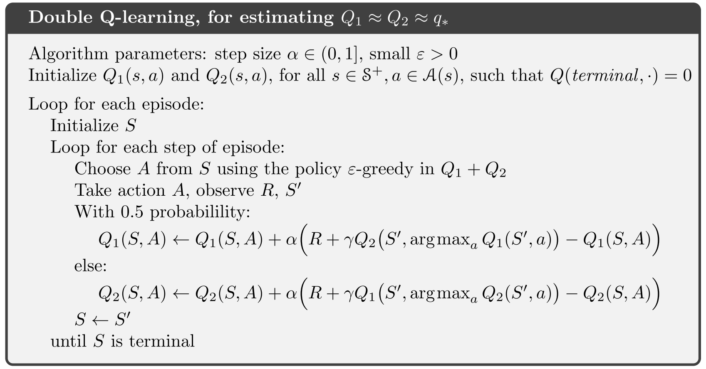

# 强化学习导论（六）- 时序差分学习

本章在上一章的基础上，进一步介绍了新的方法：**时序差分学习**（Temporal-Difference learning），简称 TD Learning:

A combination of MC and DP.

- Like MC, TD methods can learn directly from raw experience without a model of the environment’s dynamics.
- Like DP, TD methods update estimates without waiting for a final outcome (bootstrap).
- GPI

## 6.1 TD Prediction

**constant-$\alpha$ MC:**
$$
V(S_t)\leftarrow V(S_t)+\alpha\left[G_t-V(S_t)\right]
$$

**TD(0) (one-step TD):**
$$
V(S_t)\leftarrow V(S_t)+\alpha\left[R_{t+1}+\gamma V(S_{t+1})-V(S_t)\right]
$$

- MC methods must wait until the end of the episode to get $G_t$.
- TD methods need to wait only until the next time step, making a useful update using **observed** reward $R_{t+1}$ and **estimated** $V(S_{t+1})$.

**TD error:**
$$
\delta_t\doteq R_{t+1}+\gamma V(S_{t+1})-V(S_t)
$$

## 6.2 Advantages of TD Prediction Methods

### Advantages

- Do not require a model of the environment.
- Implemented in an online, fully incremental fashion. 
- For MC, if episodes are too long, they’ll delay all learning. Other applications are continuing tasks with no episodes. TD methods can solve these problems.

### Convergence

For any **fixed** policy $\pi$, TD(0) has been proved to converge to $v_\pi$ if:
$$
\sum_{k=1}^{\infty}\alpha=\infty\qquad \mathrm{and}\qquad\sum_{k=1}^{\infty}\alpha^2<\infty
$$

### Efficiency Comparison

- No one has been able to prove mathematically that which method (TD & MC) converges faster than the other.
- In practice, however, TD methods have usually been found to converge faster than constant-$\alpha$ MC methods on stochastic tasks.

**Example**:

We use $P_i$ to denote the probability of getting reward 1 when starting with node i, so 
$$
\begin{cases}
P_a=\dfrac{1}{2}P_b+\dfrac{1}{2}\times 0\\
P_b=\dfrac{1}{2}P_a+\dfrac{1}{2}P_c\\
P_c=\dfrac{1}{2}P_b+\dfrac{1}{2}P_d\\
P_d=\dfrac{1}{2}P_c+\dfrac{1}{2}P_e\\
P_e=\dfrac{1}{2}P_d+\dfrac{1}{2}\times 1\\
\end{cases}
$$
Solve the equations, we can get 
$$
P_a=\frac{1}{6},P_b=\frac{2}{6},P_c=\frac{3}{6},P_d=\frac{4}{6},P_e=\frac{5}{6}\\
V(A)=\frac{1}{6},V(B)=\frac{2}{6},V(C)=\frac{3}{6},V(D)=\frac{4}{6},V(E)=\frac{5}{6}
$$

- left graph shows estimated value after n episodes for TD(0).
- right graph shows the learning learning curves for the two methods.

## 6.3 Optimality of TD(0)

### Batch Updating

$$
V(S_t)\leftarrow V(S_t)+\alpha\left[G_t-V(S_t)\right]\\
V(S_t)\leftarrow V(S_t)+\alpha\left[R_{t+1}+\gamma V(S_{t+1})-V(S_t)\right]
$$

- The increments are computed for each t.
- But the value function is changed only once, by the sum of all increments.
- Updates are made only after processing each complete batch of training data.

### Overfit

#### Example

Suppose you observe the following 8 episodes (a batch):
$$
\begin{aligned}
(A,0,B,0)\qquad&(B,1)&(B,1)\qquad&(B,1)\\
(B,1)\qquad&(B,1)&(B,1)\qquad&(B,0)
\end{aligned}
$$
Given this **batch of data**, we can easily say $V(B)=\dfrac{3}{4}\times 1=\dfrac{3}{4}$, but how about $V(A)$?

#### TD(0) methods

$$
V_0(A)=V_0(B)=V(T)=0\\
\alpha_a=1,\alpha_b=\frac{1}{8},\gamma=1\\
\begin{aligned}
(1)&{\begin{cases}
\delta_1(A)=R_0+V_0(B)-V_0(A)=0+0-0=0\\
\delta_1(B)=\sum_{i}\left[R_{0i}+V(T)-V_0(B)\right]=6+0-0=6\\
V_1(A)=V_0(A)+1\times\delta_1(A)=0\\
V_1(B)=V_0(B)+\frac{1}{8}\delta_1(B)=\frac{3}{4}
\end{cases}}\\
(2)&{\begin{cases}
\delta_2(A)=R_1+V_1(B)-V_1(A)=0+\frac{3}{4}-0=\frac{3}{4}\\
\delta_2(B)=\sum_{i}\left[R_{1i}+V(T)-V_1(B)\right]=6+0-\frac{8\times3}{4}=0\\
V_2(A)=V_1(A)+1\times\delta_2(A)=\frac{3}{4}\\
V_2(B)=V_1(B)+\frac{1}{8}\delta_2(B)=\frac{3}{4}
\end{cases}}\\
\vdots\\
(n)&{\begin{cases}
\delta_n(A)=0,\delta_n(B)=0\\
V_n(A)=\frac{3}{4},V_n(B)=\frac{3}{4}
\end{cases}}
\end{aligned}
$$

#### MC methods

$$
V_0(A)=V_0(B)=V(T)=0\\
\alpha_a=\alpha_b=\frac{1}{8},\gamma=1\\
\begin{aligned}
(1)&{\begin{cases}
\delta_1(A)=G_1(A)-V_0(A)=0-0=0\\
\delta_1(B)=\sum_{i}\left[G_{0i}-V_0(B)\right]=6-0=6\\
V_1(A)=V_0(A)+\frac{1}{8}\delta_1(A)=0\\
V_1(B)=V_0(B)+\frac{1}{8}\delta_1(B)=\frac{3}{4}
\end{cases}}\\
(2)&{\begin{cases}
\delta_2(A)=G_1(A)-V_1(A)=0-0=0\\
\delta_2(B)=\sum_{i}\left[G_{2i}-V_1(B)\right]=6-6=0\\
V_1(A)=V_0(A)+\frac{1}{8}\delta_1(A)=0\\
V_1(B)=V_0(B)+\frac{1}{8}\delta_1(B)=\frac{3}{4}
\end{cases}}\\
\vdots\\
(n)&{\begin{cases}
\delta_n(A)=0,\delta_n(B)=0\\
V_n(A)=0,V_n(B)=\frac{3}{4}
\end{cases}}
\end{aligned}
$$

#### Certainty-Equivalence Estimate

- MC method gives **minimum squared error** on **training set**, but we can see it may be **overfitted**!
- TD(0) method gives **maximum-likelihood estimate: **$\hat{\theta}=\mathop{\arg\max}\limits_\theta p(\theta|\mathbf{x})$

The MLE is the **model** of the Markov process formed in the obvious way from the observed episodes:

1. estimated trasition probability of states.
2. estimated reward.

Given this model, we can compute the esitmate of **correct** value function, this is called **certainty-equivalence estimate**.

## 6.4 & 6.5 & 6.6 TD Control

$$
Q(S_t,A_t)\leftarrow Q(S_t,A_t)+\alpha\left[R_{t+1}+\gamma\hat{Q}(S_{t+1},A_{t+1})-Q(S_t,A_t)\right]
$$

where $\hat{Q}$ is the replaceable estimator of $Q$ in **bootstrap method**.

### Sarsa

$$
\hat{Q}(S_{t+1},A_{t+1})=Q(S_{t+1},A_{t+1})\\Q(S_t,A_t)\leftarrow Q(S_t,A_t)+\alpha\left[R_{t+1}+\gamma Q(S_{t+1},A_{t+1})-Q(S_t,A_t)\right]
$$

- this method uses $(S_t,A_t,R_{t+1},S_{t+1},A_{t+1})$, so the name is **sarsa**.
- estimate $q_\pi$ and then improve $\pi$ , so it’s an on-policy method.

### Q-learning

$$
\hat{Q}(S_{t+1},A_{t+1})=\max\limits_aQ(S_{t+1},a)\\
Q(S_t,A_t)\leftarrow Q(S_t,A_t)+\alpha\left[R_{t+1}+\gamma  \max\limits_aQ(S_{t+1},a)-Q(S_t,A_t)\right]
$$

- it’s **off-policy**, becuase it updates $Q(S_t,A_t)$ using current $\max\limits_aQ(S_{t+1},a)$ without taking next action $A_{t+1}$, after updating, we can take any actions to explore.

### Expected Sarsa

$$
\hat{Q}(S_{t+1},A_{t+1})=\mathbb{E}_\pi\left[Q(S_{t+1},A_{t+1})\mid S_{t+1}\right]\\
\begin{aligned}
Q(S_t,A_t)&\leftarrow Q(S_t,A_t)+\alpha\left[R_{t+1}+\gamma  \mathbb{E}_\pi\left[Q(S_{t+1},A_{t+1})\mid S_{t+1}\right]-Q(S_t,A_t)\right]\\
&\leftarrow Q(S_t,A_t)+\alpha\left[R_{t+1}+\gamma\sum_a\pi(a|S_{t+1})Q(S_{t+1},a)  -Q(S_t,A_t)\right]
\end{aligned}
$$

- small additional computational cost.
- lower variance and perform better.

- **Asymptotic performance**: an average over 100,000 episodes.
- **Interim performance**: an average over the first 100 episodes.

- Expected Sarsa can safely set $\alpha=1$, whereas Sarsa can only perform well with small $\alpha$.
- It can be either On-policy or Off-policy.

## 6.7 Maximization Bias and Double Learning

Many algorithms involve **maximization** to construct their target policies.

- Q-learning: $\max\limits_a Q(S_{t+1},a)$
- Sarsa: the policy is often $\varepsilon$-greddy, also involves maximization operation.

These can lead to  significant positive bias.

**Example**:

- a single state s.
- many actions a whose true values $q(s,a)$ are all 0.
- estimated values $Q(s,a)$ are uncertain, so can be above or below 0.
- the maximum of the estimates is positive, so there may be positive bias, we call this **maximization bias**.

### Double Learning

- episodes always start in A with a choice between **left** and **right** (with reward 0).
- $R(B)\sim\mathcal N(-0.1,1)$, so $V(left)=-0.1, V(right)=0$.
- However our methods may favor **left** because of maximization bias making B appear to have positive value.

**Double Learning**:

- divide samples into two sets and use them to learn two independent estimate, called $Q_1(a), Q_2(a)$, each an estimate of the true value $q(a)$.
- use one estimate to determine the maximizing action $A^*=\mathop{\arg\max}\limits_aQ_1(a)$.
- use the other to provide the estimate value $Q_2(A^*)=Q_2(\mathop{\arg\max}\limits_aQ_1(a))$.
- the estimate will be unbiased because $\mathbb{E}[Q_2(A^*)]=q(A^*)$.
- we can repeat the process and get a second unbiased estimate $Q_1(\mathop{\arg\max}\limits_aQ_2(a))$.

This is the idea of **double learning**, it can eliminate the harm caused by maximization bias.

This method doubles the memory requirements but does not increase the amount of computation.

## 6.8 Games, Afterstates, and Other Special Cases

Sometimes we need to evaluate value functions after our actions, we call these **Afterstates**.

- Afterstates are useful when we just need to have part of information.
- A more efficient learning method.

