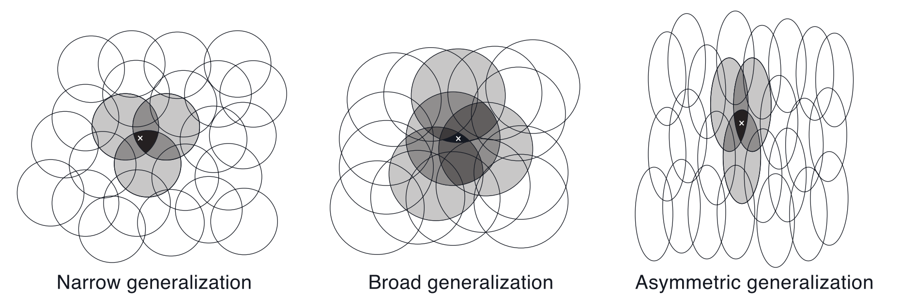

# 强化学习导论（九）- 近似预测法

前面八章讲的算法在使用旧的 $Q(S)$ 时都是在对 $Q$ 函数进行查表操作：采用数据表存储每个 state 的 value ，然后用各种各样的算法来更新这个 $Q$ 表，直到收敛。在更新的过程中也能渐渐确定出对应的最优策略。

本章在 $Q$ 函数的处理上，不再使用查表法，而是使用『**函数近似**』的方法，他和『**查表法**』的区别在于：

1. 不再使用数据表来存储各个对应关系，而是直接用函数来表示这个关系。
2. 使用『监督学习』，通过更新参数的方式来使函数收敛。

其优点在于，内存空间占用得到了较大优化（这是因为参数的个数通常远小于状态数量），同时，训练出来的函数其泛用性更佳。

## 9.1 Value-function Approximation

这一章开始，用参数化的形式表示 value function ，写作 $\hat{v}(s,\mathbf{w})$ ，其中 $\mathbf{w}$ 为训练出来的特征权重。

value function 的更新可以简单表示为映射 $s \mapsto u$ ，其中 $s$ 表示用于更新的 state，$u$ 表示被更新的 update target 。

- MC: $S_t\mapsto G_t$
- TD(0): $S_t\mapsto R_{t+1}+\gamma \hat{v}(S_{t+1},\mathbf{w}_t)$
- n-step TD: $S_t\mapsto G_{t:t+n}$
- DP: $s\mapsto \mathbb{E}_\pi[R_{t+1}+\gamma\hat{v}(S_{t+1},\mathbf{w}_t)|S_t=s]$

我们将这样的过程看作 input-output 样本，便能使用各种各样的『监督学习』方法来做训练，最终得到近似的 value function 。

## 9.2 The Prediction Objective (MSVE)

在监督学习中，我们需要设定一个目标函数来不断优化，这里我们考虑 value function 的『均方误差』：

$$
\mathrm{MSVE}(\mathbf{w})\doteq \sum_{s\in\mathcal S}\mu(s)\left[v_\pi(s)-\hat{v}(s,\mathbf{w})\right]^2
$$

其中 $\mu(s)\geq 0, \sum_s\mu(s)=1$ 为 on-policy distribution ，是状态访问次数的分布，表示了我们对于各个状态的关注程度。

对于离散型的片段式任务，$\mu$ 的定义为

$$
\begin{aligned}
\eta(s)&=h(s)+\sum_{\bar{s}}\eta(\bar{s})\sum_a\pi(a|\bar{s})p(s|\bar{s},a), \forall s \in \mathcal S\\
\mu(s)&=\frac{\eta(s)}{\sum_{s'}\eta(s')}, \forall s \in \mathcal S
\end{aligned}
$$

其中 $h(s)$ 表示状态 s 被选为初始状态的概率。

我们的目的就是要找到这个误差函数的极小值，得到极值点 $\mathbf{w}^*$ ，进而得以确定近似 value function $\hat{v}(s,\mathbf{w}^*)$ 。

## 9.3 Stochastic-gradient and Semi-gradient Methods

考虑采用随机梯度（SGD）的方法来完成上一节的目标，更新式为

$$
\begin{aligned}
\mathbf{w}_{t+1}&\doteq \mathbf{w}_t-\frac{1}{2}\alpha\nabla[v_\pi(S_t)-\hat{v}(S_t,\mathbf{w}_t)]^2\\
&=\mathbf{w}_t+\alpha[v_\pi(S_t)-\hat{v}(S_t,\mathbf{w}_t)]\nabla\hat{v}(S_t,\mathbf{w}_t)
\end{aligned}
$$

其中的 $v_\pi(S_t)$ 也可以是一个估计值 $U_t$ ，此时，若满足下列条件，可以确保收敛

- $U_t$ 是 $v_\pi(S_t)$ 的无偏估计，即有 $\mathbb{E}(U_t)=v_\pi(S_t)$
- $\sum_{n=1}^\infty \alpha_n = \infty , \sum_{n=1}^\infty\alpha_n^2<\infty$

以 MC 为例，其算法伪代码如下

一些用到了自助法（bootstrapping）的估计，如

-  n-step TD : $G_{t:t+n}=R_{t+1}+\cdots+\gamma^{n-1}R_{t+n}+\gamma^n\hat{v}(S_{t+n},\mathbf{w}_t)$
- DP : $\sum_{a,s',r}\pi(a|S_t)p(s',r|S_t,a)[r+\gamma \hat{v}(s',\mathbf{w}_t)]$

这些估计值都与权向量 $\mathbf{w}$ 相关，被其偏置（biased），这类 target 代入梯度更新式后，只能得到部分梯度的下降，而非真正的梯度下降，故称其为『**半梯度法**（semi-gradient methods）』

半梯度法与普通的梯度下降形式一致，区别仅在于 target 的选取，即训练样本的 output 是否是 input 的无偏估计。

半梯度法虽然收敛性不如真正的梯度下降法，但他有如下优点：

1. 半梯度法在线性模型下仍能**确保**收敛。
2. 在可收敛的前提下，半梯度法收敛速度很快。
3. 半梯度法可用于连续型任务，无需等待一个完整的 episode 结束。

下面给出一个使用半梯度法的示例：

## 9.4 Linear Methods

在线性近似的方法中，将 value function 看作 $\mathbf{w}$ 的线性函数，此时为权重与特征的内积

$$
\hat{v}(s,\mathbf{w})\doteq\mathbf{w}^T\mathbf{x}(s)\doteq \sum_{i=1}^dw_ix_i(s)
$$

代入更新式即为

$$
\mathbf{w}_{t+1}\doteq\mathbf{w}_t+\alpha[U_t-\hat{v}(S_t,\mathbf{w}_t)]\mathbf{x}(S_t)
$$

上一节的半梯度 TD(0) 算法能够在线性函数逼近中收敛，迭代式为

$$
\begin{aligned}
\mathbf{w}_{t+1}&\doteq\mathbf{w}_t+\alpha(R_{t+1}+\gamma\mathbf{w}_t^T\mathbf{x}_{t+1}-\mathbf{w}_t^T\mathbf{x}_t)\mathbf{x}_t\\
&=\mathbf{w}_t+\alpha(R_{t+1}\mathbf{x}_t-\mathbf{x}_t(\mathbf{x}_t-\gamma\mathbf{x}_{t+1})^T\mathbf{w}_t)
\end{aligned}
$$

也可写作
$$
\mathbb{E}[\mathbf{w}_{t+1}|\mathbf{w}_t]=\mathbf{w}_t+\alpha(\mathbf{b}-\mathbf{Aw}_t)
$$

其中

$$
\begin{cases}
\mathbf{b}\doteq\mathbb{E}[R_{t+1}\mathbf{x}]\in \mathbb{R}^d\\
\mathbf{A}\doteq\mathbb{E}[\mathbf{x}_t(\mathbf{x}_t-\gamma\mathbf{x}_{t+1})^T]\in \mathbb{R}^d\times\mathbb{R}^d
\end{cases}
$$

当收敛时，有

$$
\begin{aligned}
&\mathbf{b}-\mathbf{Aw}_{TD}=\mathbf{0}\\
\Rightarrow&\mathbf{b}=\mathbf{Aw}_{TD}\\
\Rightarrow&\mathbf{w}_{TD}=\mathbf{A}^{-1}\mathbf{b}
\end{aligned}
$$

这个值称为『**TD 不动点**』，根据一些定理可以证明确实能够收敛于此点。线性半梯度 TD(0) 算法的收敛值就是这个不动点，他有一个性质：
$$
\mathrm{MSVE}(\mathbf{w}_{TD})\leq\frac{1}{1-\gamma}\min_\mathbf{w}\mathrm{MSVE}(\mathbf{w})
$$

即 TD(0) 法得到的误差不超过 MC 法的 $\dfrac{1}{1-\gamma}$ 倍。

## 9.5 Feature Construction for Linear Methods

线性方法的局限在于，我们所考虑到的特征之间是**彼此独立**的，即没有考虑到两个特征间的联系。但对一些特征，需要考虑他们之间的联系，接下来讨论几种具体的方法。

### 9.5.1 Polynomials

一个例子，若直接用 $\mathbf{x}(s)=(s_1,s_2)^T$ 表示状态特征，就不能体现这两个维度特征的交互，此时可以考虑 $\mathbf{x}(s)=(1,s_1,s_2,s_1s_2)^T$ 则能够克服这一问题。

对于这种多项式形式的特征，更一般的构造方法是：

$$
x_i(s)=\prod_{j=1}^ks_j^{c_{i,j}}
$$

其中 $c_{i,j}\in\{0,1,\ldots,n\}$ ，$x_i(s)$ 构成向量 $\mathbf{x}(s)$ 。

### 9.5.2 Fourier Basis

傅里叶方法考虑使用 $\sin, \cos$ 函数来作为基函数，如果将 T 设为原来的两倍，便能在半周期 $[0,\dfrac{T}{2}]$ 内，只用 $\cos$ 或只用 $\sin$ 作基函数，但 $\sin$ 函数的线性组合往往是奇函数，容易在原点处不连续，所以一般考虑用 $\cos$ 作为基函数。

适用傅里叶基来构造特征向量：

$$
x_i(s)=\cos(\pi c^i\cdot s)
$$

其中

$$
c^i=(c_1^i, \cdots, c_k^i)^T , c_j^i \in \{0, \cdots, N\} , j = 1, \cdots, k , i = 0, \cdots ,(N+1)^k
$$

效果：

### 9.5.3 Coarse Coding

下面讲一种特征编码方法——**粗编码**（Coarse Coding）。

状态 s 所在的圆的特征值记为 1 ，其他记为 0  ，这样便在各个圆上定义了一个 0-1 的二维特征，表示状态 s 是否处于这个圆中。称这样定义出来的特征编码为『**粗编码**（coarse coding）』。

在线性梯度下降逼近法中，每个圆对应的是会被影响到的参数（$\mathbf{w}$ 中的一个分量），这样编码，便能优先更新与状态 s 相关性高（图中体现为几个相邻近的圆）的特征对应的参数。

这样的编码需要事先构造好这些圆，不同的形状大小也有着不同的泛化特性。

### 9.5.4 Tile Coding

上面的粗编码定义抽象，实际中很难在程序中定义出图中各个圆所描述出的位置和大小关系。一种解决方案就是使用形式简单的网格来对特征进行编码。

编码方式以下面一个示例为例：

事先定义好四个用于分割的 $4\times 4$ 大方格（其实是由同一个大方格平移得到），每个大方格中白点所在的方格记为 1 ，其他记为 0（图例中具体而言，表示在总共有 64 个特征分量，只有 4 个分量记为 1 ，其他全为 0 ），这样便定义出了一种特征编码，称为『**片编码**（tile coding）』。

不同的平移方式能编出不同形式的编码，如下图所示

片编码的优势在于，因为使用对空间的划分作为网格，对每个状态 s 而言，其活跃的特征分量数是固定的（网格数决定），实际应用中便于实现。

不同的网格形状还能决定不同的泛化特点，表达出各种各样的特征。

### 9.5.5 Radial Basis Functions

『**径向基函数**（RBF）』是对粗编码的一种拓展，相对于 0-1 特征，RBF 特征可以是 0 到 1 之间的任意数字。经典的 RBF 特征 $x_i$ 作为一个高斯形式的反馈，只依赖状态 s 与设定的中心状态 $c_i$ 间的距离，以及特征的相对宽度 $\sigma_i$ 。

$$
x_i(s)\doteq \exp\left(-\frac{||s-c_i||^2}{2\sigma_i^2}\right)
$$

理论上使用 RBF 特征可以使近似函数更平滑，但实际上实用性较差。

## 9.6 Nonlinear Function Approximation: Artificial Neural Networks

参数 $\mathbf{w}$ 也可使用人工神经网络（ANN）来训练。

这一节简单介绍了神经网络中的一些概念。

## 9.7 Least-Squares TD

9.4 节中讲过线性函数逼近的 TD(0) 算法

$$
\mathbb{E}[\mathbf{w}_{t+1}|\mathbf{w}_t]=\mathbf{w}_t+\alpha(\mathbf{b}-\mathbf{Aw}_t)
$$

会收敛于 TD 不动点 $\mathbf{w}_{TD}=\mathbf{A}^{-1}\mathbf{b}$ ，其中

$$
\begin{cases}
\mathbf{b}\doteq\mathbb{E}[R_{t+1}\mathbf{x}]\in \mathbb{R}^d\\
\mathbf{A}\doteq\mathbb{E}[\mathbf{x}_t(\mathbf{x}_t-\gamma\mathbf{x}_{t+1})^T]\in \mathbb{R}^d\times\mathbb{R}^d
\end{cases}
$$

其实也可以不做迭代，而是每步都直接算出这个不动点，就是本节的 LSTD 算法：

$$
w_{t+1}\doteq\widehat{\mathbf{A}}_t^{-1}\widehat{\mathbf{b}}_t
$$

其中

$$
\begin{cases}
\widehat{\mathbf{b}}_t\doteq \sum_{k=0}^{t-1}R_{t+1}\mathbf{x}\\
\widehat{\mathbf{A}}_t\doteq\sum_{k=0}^{t-1}\mathbf{x}_t(\mathbf{x}_t-\gamma\mathbf{x}_{t+1})^T+\varepsilon\mathbf{I}
\end{cases}
$$

$\varepsilon$ 为一个较小的正数，$\varepsilon \mathbf{I}$ 确保 $\widehat{\mathbf{A}}$ 可逆。

$\widehat{\mathbf{A}}_t^{-1}$ 的计算可以写作增量式

$$
\begin{aligned}
\widehat{\mathbf{A}}_t^{-1}&=\left(\widehat{\mathbf{A}}_{t-1}+\mathbf{x}_t(\mathbf{x}_t-\gamma \mathbf{x}_{t+1})^T\right)^{-1}\\
&=\widehat{\mathbf{A}}_{t-1}^{-1}-\frac{\widehat{\mathbf{A}}_{t-1}^{-1}\mathbf{x}_t(\mathbf{x}_t-\gamma \mathbf{x}_{t+1})^T\widehat{\mathbf{A}}_{t-1}^{-1}}{1+\mathbf{x}_t(\mathbf{x}_t-\gamma \mathbf{x}_{t+1})^T\widehat{\mathbf{A}}_{t-1}^{-1}\mathbf{x}_t}
\end{aligned}
$$

此算法复杂度为 $O(d^2)$ ，比直接做求逆运算（复杂度 $O(d^3)$）要快。

LSTD 比普通的迭代法（复杂度 $O(d)$）计算量更大，但是他的优势在于对数据的利用**效率**更高。

此外，LSTD 无需设置步长参数 $\alpha$ ，取而代之地是只需设置一个较小的 $\varepsilon$ 即可，省去了调参的环节。但是没有步长 $\alpha$ 意味着这个算法缺乏『**遗忘性**』，很多时候强化学习方法都需要引入遗忘机制，因此 LSTD 一般都是与这类遗忘机制结合使用。

## 9.8 Memory based Function Approximation

这一节简单介绍基于记忆的非参数估计方法。将样本保存于内存中，当有查询需求的时候，取出一组样本用于计算状态的估计值，也称这种方法为 lazy learning 。

这一节主要关注 local-learning ，如

- nearest neighbor ：找到内存中和 s 最近的状态，然后直接将其值作为 s 的估计值。
- weighted neighbor ：将 s 周围的几个状态做加权平均后作为估计值。
- locally weighted regression ：利用距离定义一个加权意义下的误差（类似 9.1 式），然后根据这个误差做回归得到拟合曲面，在这个曲面上求值来作为 s 的估计值。

作为非参数方法，其优点有

- 精确度随数据量提升而增加，无需担心收敛问题。
- 能很自然地关注样本受邻近状态的影响，而无需像参数化方法做一些人工调整。
- 能够解决『维度灾难』。这是因为他只需要正比于 n 的空间来存样本，但参数化方法则需要指数级的空间来存储参数，这在复杂的高维问题有着明显的差异。

## 9.9 Kernel-based Function Approximation

kernel regression 其实仍为 memory-based methods：

$$
\hat{v}(s,D) = \sum_{s^\prime \in D} k(s,s^\prime)g(s^\prime)
$$

- $D$ 表示保存的样本
- $g(s')$ 表示在保存样本中，$s'$  的 target

线性参数回归也可看作核方法，使用的是线性核函数：

$$
k(s,s^\prime) = \mathbf{x}(s)^T\mathbf{x}(s^\prime)
$$

核技巧：仅使用存储的训练数据，在高维特征空间中有效地工作。

## 9.10 Looking Deeper at On-policy Learning: Interest and Emphasis

前面讲的算法对于各状态都是同等重视程度，事实上有些状态应该更加重视，这里引入两个新概念：

- interest $I_t$ ：表示在 t 时刻对当前状态的关注程度，如果希望这次估值能够更准确，则 $I_t$ 应尽量为 1，否则若不关注，则应接近 0 。而前面提到过的分布 $\mu$ 就可以利用 $I_t$ 来对样本加权后求得。
- emphasis $M_t$ ：$M_t$ 用于强化或弱化这一次的学习。

下面是一个例子：

$$
\mathbf{w}_{t+n} \doteq \mathbf{w}_{t+n-1}+\alpha M_t[G_{t:t+n}-\hat{v}(S-t,\mathbf{w}_{t+n-1})]\nabla \hat v(S_t, \mathbf{w}_{t+n-1})
$$

其中

$$
M_t = I_t+\gamma^n M_{t-n}, \qquad 0 \leq t < T
$$
